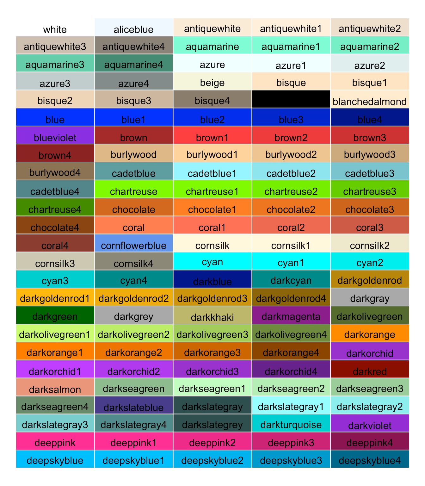

Configurer l'environnement R

```{r}
library(tidyverse)
library(palmerpenguins)
penguins <- na.omit(penguins)
```

### 1. Bases de `ggplot()`

Maintenant, vous allez faire votre premier graphique étape par étape. Exécutez le code suivant qui vous entraînera à faire un graphique de base. Essayez de comprendre chaque étape. Cela vous préparera à effectuer les tâches ci-dessous.

#### 1. Configurer la toile

```{r}
ggplot(data = penguins)
```

*Vous voyez qu'une seule zone grise, le canevas, est dessinée. C'est parce que comme ça, `ggplot()` n'a aucune idée de ce que vous voulez.*

#### 2. Définir la toile

```{r}
ggplot(data = penguins, aes(x = bill_length_mm, y = body_mass_g))
```

*Maintenant, nous avons ajouté les "attributs esthétiques" (in* `aes()`*). Notez que* `bill_length_mm` *et* `body_mass_g` *font référence aux noms de colonnes de votre cadre de données. Cela signifie que les noms doivent correspondre exactement.* *Exécutez le code, et vous verrez que maintenant,* `ggplot()` *sait déjà ce que vous voulez tracer (donc il peut ajouter les étiquettes des axes) mais il ne sait toujours pas **comment** vous voulez le tracer.*

#### 3. Définir la géométrie

*Cela peut être fait avec "geoms". Cela indique à* `ggplot()` *si vous voulez représenter les données sous forme de points, de lignes, de zones, etc.*

```{r}
ggplot(data = penguins, aes(x = bill_length_mm, y = body_mass_g)) +
    geom_point()
```

Gardez à l'esprit que pour combiner différentes couches dans `ggplot()` (c.-à-d. la couche "configuration" à la ligne 1 et la représentation réelle en tant que points à la ligne 2) avec le signe `+`. Cela restera le même pour tout code `ggplot()`.

#### 4. Définir davantage la géométrie

Maintenant, nous pouvons ajouter des informations supplémentaires au graphique. Par exemple, nous pouvons représenter l'espèce avec des couleurs. Rappelez-vous que tout dans `aes()` doit correspondre à une colonne dans le cadre de données. Ici, la colonne `species` fait référence à un facteur. Vous souvenez-vous ce que c'est ? Si non, regardez le TP de la semaine dernière.

Pourquoi est-il utile dans ce cas que `species` soit un facteur ?

```{r}
ggplot(data = penguins, aes(x = bill_length_mm, y = body_mass_g, colour = species)) +
    geom_point()
```

#### 5. Personnaliser le graphique

Maintenant, la base du graphique est configurée. Nous pouvons maintenant adapter son apparence. La première étape importante consiste à configurer des étiquettes appropriées :

```{r}
ggplot(data = penguins, aes(x = bill_length_mm, y = body_mass_g, colour = species)) +
    geom_point() + 
    labs(x = "Bill length (mm)", y = "Body mass (g)")
```

#### 6. Personnaliser le graphique

Nous pouvons également adapter le style global. Cela se fait avec des "thèmes" :

```{r}
ggplot(data = penguins, aes(x = bill_length_mm, y = body_mass_g, colour = species)) +
    geom_point() + 
    labs(x = "Bill length (mm)", y = "Body mass (g)") +
    theme_minimal()
```

### Tâche 1

Utilisez différents thèmes pour le graphique que nous venons de créer ci-dessus. Voici une liste de thèmes standard, mais il existe de nombreux packages R qui élargissent vos choix :

-   `theme_bw()` : une variation de `theme_grey()` qui utilise un fond blanc et des lignes de grille grise fine.

-   `theme_linedraw()` : un thème avec uniquement des lignes noires de différentes largeurs sur des fonds blancs, rappelant un dessin au trait.

-   `theme_light()` : similaire à `theme_linedraw()` mais avec des lignes et des axes gris clair, pour diriger plus d'attention vers les données.

-   `theme_dark()` : le cousin sombre de `theme_light()`, avec des tailles de ligne similaires mais un fond sombre. Utile pour faire ressortir les lignes colorées fines.

-   `theme_minimal()` : un thème minimaliste sans annotations de fond.

-   `theme_classic()` : un thème d'apparence classique, avec des lignes d'axe x et y et pas de lignes de grille.

```{r}
ggplot(data = penguins, aes(x = bill_length_mm, y = body_mass_g, colour = species)) +
    geom_point() + 
    labs(x = "Bill length (mm)", y = "Body mass (g)") +
    ____
```

### Tâche 2

Pour personnaliser davantage votre graphique, vous pouvez utiliser des couleurs personnalisées. Vous pouvez utiliser des couleurs prédéfinies, comme `scale_colour_colourblind()` ou `scale_colour_viridis_d()`. Vous pouvez également utiliser directement une liste de couleurs que vous avez choisies avec `scale_colour_manual(values = c("red", "green","blue"))`. Voici les choix possibles pour ces couleurs manuelles :

{width="300"}

Remplacez les `____` ci-dessous par une échelle de couleur de votre choix.

```{r}
ggplot(data = penguins, aes(x = bill_length_mm, y = body_mass_g, colour = species)) +
    geom_point() + 
    labs(x = "Bill length (mm)", y = "Body mass (g)") +
    ___ +
    theme_minimal()
```

### Tâche 3

Prenez le graphique que nous avons créé ci-dessus. En plus des différentes couleurs, utilisez également différentes formes de points pour les différentes espèces. Remplacez le `____` par le nom de colonne approprié :

```{r}
ggplot(data = penguins, aes(x = bill_length_mm, y = body_mass_g, colour = species, shape = ____)) +
    geom_point() + 
    labs(x = "Bill length (mm)", y = "Body mass (g)") +
    theme_classic()
```

### Tâche 4

Jusqu'à présent, nous avons utilisé des données catégoriques pour les différentes couleurs. Que se passe-t-il si vous utilisez une variable numérique pour définir les différentes couleurs ? Remplacez le `____` ci-dessous par une colonne numérique, par ex. `flipper_length_mm`. N'oubliez pas de mettre à jour également les étiquettes utilisées pour la couleur. Changez le `____` dans `labs()` pour quelque chose d'utile. N'oubliez pas que tout texte doit être enveloppé avec `""`.

```{r}
ggplot(data = penguins, aes(x = bill_length_mm, y = body_mass_g, colour = ____, shape = species)) +
    geom_point() + 
    labs(x = "Bill length (mm)", y = "Body mass (g)", colour = ____) +
    scale_colour_viridis_c() +
    theme_classic()
```

*Notez que j'utilise* `scale_colour_viridis_c()` *comme une échelle de couleur continue personnalisée car elle montre les différences mieux que l'échelle de couleur standard.*

### Tâche 5

Regardez le graphique que vous venez de créer. Quel est la relation entre la longueur du bec, la masse corporelle et la longueur des nageoires ?

### Tâche 6

Jusqu'à présent, nous avons principalement tracé deux variables numériques (`bill_length_mm` et `body_mass_g`) et étendu cela avec une troisième variable (catégorique : `species`, numérique : `flipper_length_mm`). Reconsidérez les différents types de graphiques que j'ai vous montrés dans la conférence. Commençons par tracer une seule variable numérique sous forme d'histogramme :

```{r}
ggplot(data = penguins, aes(x = bill_length_mm)) + 
    geom_histogram() +
    theme_classic()
```

Notez que seule une variable `x` doit être donnée dans `aes()`. L'axe y représente la fréquence de chaque valeur et est directement calculé par `ggplot()`.

Vous pouvez modifier la largeur des barres. Cela peut être utile, car chaque barre représente la fréquence d'une plage de valeurs (par exemple, des étapes de 5 mm). Vous pouvez le faire avec l'argument `bins`. Essayez différentes valeurs ci-dessous et voyez ce qui se passe :

```{r}
ggplot(data = penguins, aes(x = bill_length_mm)) + 
    geom_histogram(bins = ____) +
    theme_classic()
```

### Tâche 7

Les graphiques en barres sont couramment utilisés pour visualiser la fréquence des variables catégoriques. Encore une fois, `ggplot()` peut calculer l'occurrence de chaque niveau de facteur (par exemple, espèce) avec `stat = "count"`.

```{r}
penguins %>%
	ggplot(aes(x = species)) +
	geom_bar(stat = "count") +
    theme_classic()
```

Maintenant, tracez de la même manière l'île où les manchots ont été observés. Utilisez la colonne `island`.

```{r}
ggplot(data = penguins, aes(x = ____)) +
	geom_bar(stat = "count") +
    theme_classic()
```

### Tâche 8

Si vous voulez tracer une variable numérique et une variable catégorique, il est souvent utile de montrer pour chaque groupe (c.-à-d. le niveau de la variable catégorique) la moyenne et l'écart-type de la variable numérique. L'écart-type vous renseigne sur la variabilité d'un groupe de valeurs - vous en apprendrez plus à ce sujet la semaine prochaine. Les fonctions de résumé `ggplot()` peuvent être très pratiques :

```{r}
ggplot(data = penguins, aes(x = island, y = flipper_length_mm)) +
    geom_pointrange(stat = "summary", fun.data = mean_sdl) +
    theme_classic()
```

Dans ce graphique, le point représente la moyenne et la ligne l'écart-type. Faire cela pour les données groupées par île n'est pas très utile. Adaptez le graphique ci-dessous pour qu'il affiche la longueur des nageoires groupée par espèce :

```{r}
ggplot(data = penguins, aes(x = ____, y = flipper_length_mm)) +
    geom_pointrange(stat = "summary", fun.data = mean_sdl) +
    theme_classic()
```

### Tâche 9

Cependant, ces chiffres peuvent cacher à quoi ressemblent réellement les données. Je recommande habituellement de tracer une sorte de résumé (comme la moyenne et l'écart-type) et les données brutes elles-mêmes. Vous avez vu dans la conférence que `ggplot()` nous permet de combiner différents graphiques. Ci-dessous, je trace chaque donnée brute en arrière-plan, puis le résumé sur le dessus. J'utilise `geom_jitter()` ici, ce qui aide à afficher des valeurs très similaires qui se chevauchaient autrement. `geom_jitter()` ajoute du bruit aléatoire le long de l'axe des x et permet ainsi de voir tous les points de données.

Notez que j'ai utilisé `alpha`, qui indique la transparence d'affichage d'un point de données. 0 est complètement transparent, 1 n'est pas du tout transparent. La semi-transparence aide ici à visualiser des données similaires.

Que se passe-t-il si vous n'utilisez pas `geom_jitter()` mais le `geom_point()` "standard" ? Essayez ci-dessous :

```{r}
ggplot(data = penguins, aes(x = species, y = flipper_length_mm)) +
    ____(alpha = .4) +
    geom_pointrange(stat = "summary", fun.data = mean_sdl) +
    theme_classic()
```

### Tâche 10

En dernière étape, essayez de personnaliser le graphique pour que vous réalisiez quelque chose de similaire à celui-ci. Pensez à quelle colonne est utilisée pour quoi.

{width="500"}

Voici le graphique "base" comme point de départ :

```{r}
ggplot(data = penguins, aes(x = species, y = flipper_length_mm)) +
    geom_jitter(alpha = .4) +
    geom_pointrange(stat = "summary", fun.data = mean_sdl) +
    theme_classic()
```