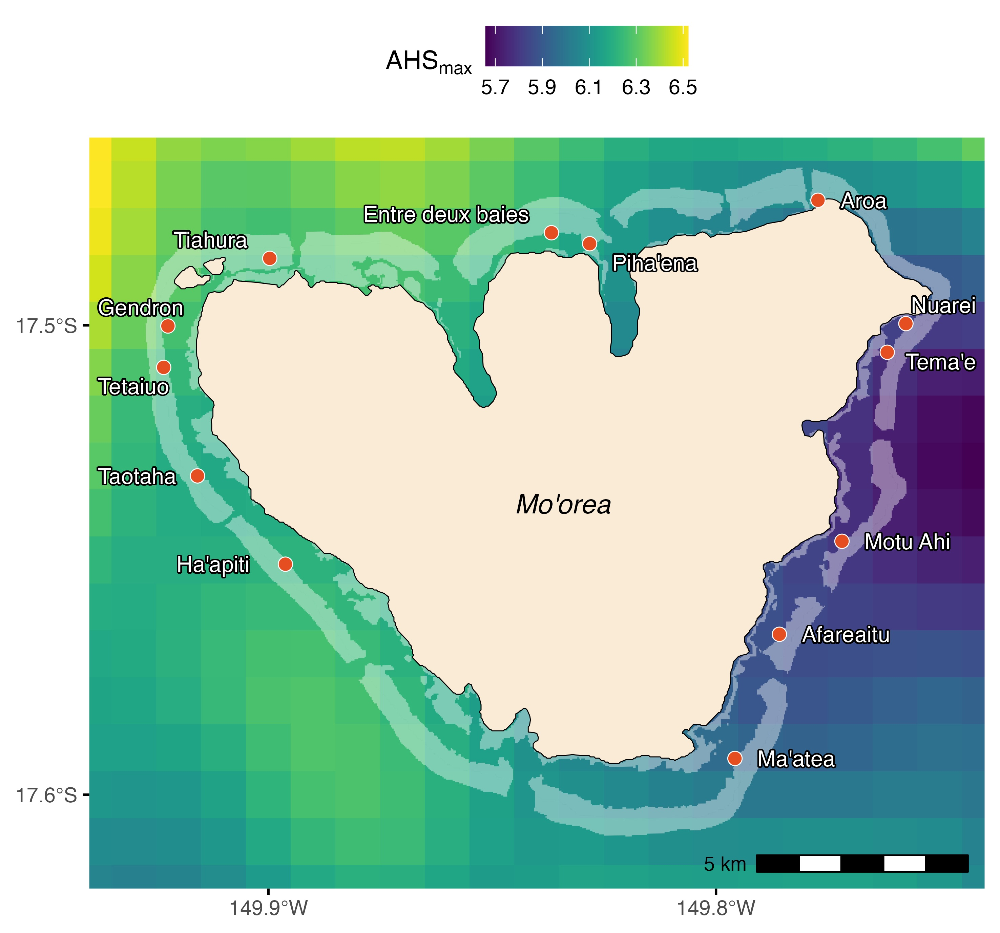
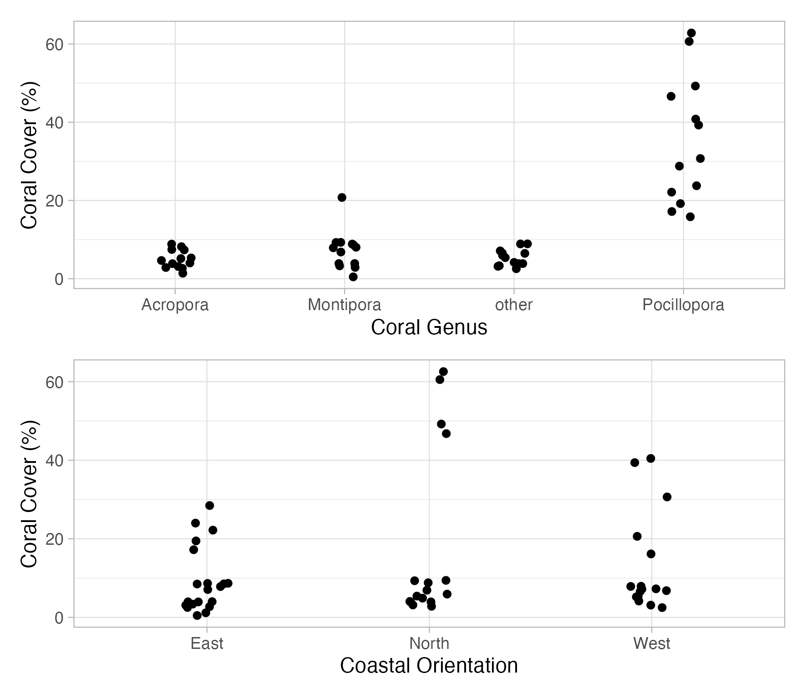

### Regression

Now, we will analyse actual data. As in the presentation, we will start with a regression. This analysis is part of my PhD, where I investigated the impact of the 2019 bleaching event on coral mortality in Moorea. This was the most intense bleaching event in Moorea in the last decades and caused widespread mortality. As you can see in the figure, the maximum accumulated heat stress ($\mathrm{ahs_{max}}$) differed around the island. I combined this satellite data with data for the coral cover from benthic transects to test if the intensity of the heat stress impacted the bleaching mortality.

{width="500"}

```{r}
library(tidyverse)
library(here)
library(modelbased)
dat_change_coral <- read.csv(here("TP/TP_03/data/coral_mortality.csv"))
```

The first step of any analysis is "data exploration", it is done to better understand the data and to see general trends.

### Task 1

The data frame `dat_change_coral` contains the coral mortality due to the bleaching event at each site on the map above with the corresponding maximum accumulated heat stress. Plot the column `max_ahs` (i.e. the maximum intensity of accumulated heat stress) on the x-axis, and `perc_mort` (i.e. coral mortality in percent) on the y-axis and draw a scatter plot. Remember TP 02, you should be able to complete this task.

```{r}
ggplot(data = ____, aes(x = ____, y = ____)) +
  geom_point() +
  labs(
    x = expression(DWH[max]),
    y = expression(Mortality ~ "(%)")
  ) +
  theme_light()
```

Before you continue, think about what do you see here? Would you think it is an interesting relationship to explore?

------------------------------------------------------------------------

There seems to be a positive relationship between coral mortality and the intensity of the heat stress. We will now build a linear model (in this case, a regression) to test if this relationship is statistically significant. The mathematical formula for the model is:

$$
\begin{align}
\mathrm{Mortality}_i \sim \mathrm{Normal(\mu}_i,~\mathrm{\sigma)} \\
\mu_i = a + b \cdot \mathrm{heatstess}_i
\end{align}
$$

, where $\mathrm{Mortality}_i$ is the coral mortality at site $i$ (`perc_mort`), and $\mathrm{heat stess}_i$ the maximum accumulated heat stress at that site (`max_ahs`).

### Task 2


Translate this model into the R's `lm()` and as always, replace the `____`. Keep in mind, that you want to investigate how coral mortality (`perc_mort`) is impacted by the maximum accumulated heat stress (`max_ahs`).

```{r}
m_cor_mort <- lm(____ ~ ____, data = dat_change_coral)
```

### Task 3

Once you created the model, you can check the coefficients (y-intercept and slope), p-value, and $R^2$ value with the `summary()` command:

```{r}
summary(m_cor_mort)
```

**What does this tell you?**

Think of the linear equation for the association between heat stress and coral mortality. What is the expected increase (or decrease?) in mortality for each increase in one unit of `max_ahs`? What is the $R2$ values? Is the relationship of heat stress on mortality statistically significant of or not?

------------------------------------------------------------------------

In publications, we often want to plot such results as a line with a uncertainty band (you will see what I mean in a bit). You can do this as follows. First, we need to predict data based on the model. The `estimate_relation()` function from the package `modelbased` that you loaded further above, does exactly this. Using the information from the model, it simulates (or predicts) the expected coral mortality for different values of heat stress:

```{r}
pred_cor_mort <- estimate_relation(m_cor_mort)
```

Have a look at the `pred_cor_mort` data frame in the environment tab on the top right. You will see that for each $\mathrm{ahs_{max}}$ that was present in the data, the corresponding coral mortality value is given. Keep in mind that these are really the results of the model, not the raw data. The `estimate_relation()` function can also predicted the theoretical mortality at $\mathrm{ahs_{max}}$ not present in the data! You will also find a column `SE`, containing the standard error of the predictions, and columns for the lower and upper confidence interval (`CI_low` and `CI_high`). The range of the CI represents the uncertainty for the regression line. In scientific publications, this is often represented by a grey band/area around the line.

To produce the plot that contains the raw data, the regression line, and the uncertainty of that line, we can use different `ggplot` layers (you learned this last week). A new information is that each layer can come from another data set. You define this data with `data =` for each layer. If you do not define `data =` for a layer, the data used in the main `ggplot()` function (first line) will be used for all layers.

```{r}
ggplot(data = dat_change_coral, aes(x = max_ahs, y = perc_mort)) +
  geom_point() +
  labs(
    x = expression(DWH[max]),
    y = expression(Mortality ~ "(%)")
  ) +
  geom_ribbon(
    data = pred_cor_mort,
    aes(ymin = CI_low, ymax = CI_high, x = max_ahs, y = NULL),
    alpha = 0.2,
    color = NA
  ) +
  geom_line(data = pred_cor_mort, aes(x = max_ahs, y = Predicted)) +
  theme_light()
```

### Task 4

Have a look at each line of code I used for this plot.

1.  Do you understand how it works? What do you think which part is plotted first, the points (raw data), the regression line, or the grey area?
2.  Do you have an idea why the grey area has this "bow tie" shape?

*Have a look at the help page for answers.*

**Hints:**

-   Keep in mind that here, not the expected values ($\mathrm{Mortality}_i \sim \mathrm{Normal(\mu}_i,~\mathrm{\sigma)}$) including $\mathrm{\sigma}$ is shown, but the certainty of the model to estimate the $\mathrm{\mu}_i$ part
-   In the `geom_ribbon()` layer (which draws the grey area), I used `y = NULL`. This is because each layer takes all information from the main `ggplot()` function (as i explained above for `data =`). Since in the main function `y = perc_mort`, a column that only exists in `dat_change_coral` but not in `pred_cor_mort`, I had to tell the `geom_ribbon()` layer, that this column does not exist in for this layer and cannot be drawn on the y axis. This is done with `y = NULL`.

### ANOVA

Above, we performed a regression analysis. But in the presentation, I showed you that ANOVA, i.e. testing differences among the mean of groups, is similar to a regression that only estimates y-intercepts for each group, but no slope.

Here, we could test if there are differences in the coral cover between the different sites before the bleaching event.

This data contains the mean coral cover in percent before the 2019 bleaching event at each site on Moorea.

```{r}
dat_coral_cover <- read.csv(here("TP/TP_03/data/coral_cover.csv"))
```

As before, the first step of each analysis is doing an explanatory analysis, i.e. plotting the raw data. Here, plot the coral cover at each site using `position_jitter()`. I grouped the data by the coastal orientation (have a look at the map above).

```{r}
ggplot(data = dat_coral_cover, aes(x = coast, y = percent_cover, col = coast)) +
  geom_point(position = position_jitter(width = .1)) +
  theme_light()
```

### Task 5

It seems that the coral cover depends on the coastal orientation! Let's do an ANOVA to test this. We want to test the impact of `coast` on `percent_cover`:

```{r}
m_cor_cover <- lm(____ ~ ____, data = dat_coral_cover)
```

We can now use the `summary()` and `anova()` functions to display the $R^2$ values and the p-value for the impact of `coast` on `percent_cover`:

```{r}
summary(m_cor_cover)
```

```{r}
anova(m_cor_cover)
```

With the p value below 0.05, we know that there is a statistically significant impact of coastal orientation on coral cover. But we don't know which group (coastal orientation) differs from which other group. To do so, we have to run post hoc tests. I will explain more about this next week. But a visualistaion of the model already gives some hints.

Using a similar approach as for the regression above, we can predict use the `estimate_relation()` function to calculate the model-based group means and confidence intervals:

```{r}
pred_cor_cover <- estimate_relation(m_cor_cover)
```


```{r}
ggplot(data = dat_coral_cover, aes(x = coast, y = percent_cover, col = coast)) +
  geom_point(position = position_jitter(width = .1)) +
  geom_pointrange(
    data = pred_cor_cover,
    aes(x = coast, y = Predicted, ymin = CI_low, ymax = CI_high)
  ) +
  labs(
    x = "Coastal Orientation",
    y = "Coral Cover (%)"
  ) +
  theme_light()
```


### Task 6

Do you have any idea that might explain these differences biologically? Consider, that the reefs in Moorea were completely destroyed in 2010 due to an outbreak of Crown-of-thorns starfish, a coral predator, followed by a cyclone in 2010. The recovery afterwards until 2019 was very fast compared to other reefs. We also know that the cyclone hit the North and West harder than the East of Moorea. Why could this have been an advantage for the recovery at those sites?


### Additve and Interactive Effects

But often in biological systems, there are multiple variables that may ibe important. In the last model, for example, we looked at overall coral cover at different sites. But the genus of the coral may play an important role as well!

Let's load the data containing information on the genus as well

```{r}
dat_coral_cover_genus <- read.csv(here("TP/TP_03/data/coral_cover_genus.csv"))
```

As always, first plot the data:

```{r}
ggplot(
  data = dat_coral_cover_genus,
  aes(x = genus, y = percent_cover, col = coast)
) +
  geom_point(
    position = position_jitterdodge(jitter.width = .1, dodge.width = .4)
  ) +
  labs(
    x = "Coastal Orientation",
    y = "Coral Cover (%)"
  ) +
  theme_light()
```

Just by looking at the data, we see that the main impact on the differences in coral cover was due to *Pocillopora* corals, the dominant genus at Moorea. There seems to be only minor differences for the other genera.

In R, we can easily look at the combined impact of coast (as before, model `m_cor_cover`) and genus, a new explanatory variable. Just add it!

```{r}
m_cor_cover_add <- lm(
  percent_cover ~ coast + genus,
  data = dat_coral_cover_genus
)
summary(m_cor_cover_add)
anova(m_cor_cover_add)
```

Such a model is called an *additive* model. It looks separately and independently at the impact of coast and of genus. Both are stat significantly This resembles the following plot:

{width="500"}

But we are interested at both impacts at the same time! In other words, how does the coral cover differ among coastal orientation depending on the coral genus?

For this, we need *interactions*! In R models, this is done by replacing the `+` with a `*`:

```{r}
m_cor_cover_int <- lm(
  percent_cover ~ coast * genus,
  data = dat_coral_cover_genus
)
summary(m_cor_cover_int)
anova(m_cor_cover_int)
```

When the interaction being significant, we know that genus impacts the way that the coastal orientation impacts coral cover. This could be either because only for some genera there is a significant impact of coast, or that the direction of the impact of coast differs between the different genera. Often plotting the data helps to have an idea. And next week, we will learn to do actual tests on this, so pairwise tests between all the different groups.

### ANCOVA

Something similar can be done in regression as well. You may be not only interested in the impact of one explanatory numeric variable, but also if this impact differ between different groups. Such models are calles ANCOVA.

We use the penguin data set that you already know well for this. Similar to the coral cover for different genera described above, you will now look at the impact of penguin species on the relationship between flipper lenght and body mass. 

Load the package that contains the data:

```{r}
library(palmerpenguins)
```


### Task 7

As always, first visualise the data.  Produce a scatter plot with `body_mass_g` on the x axis, `flipper_length_mm` on the y axis, and colour the points according to `species`. Write your own R code below:

```{r}

```


### Task 8

#### Model

Now, you will build your own model. Use the `lm()` function to test the impact of `body_mass_g` and `species` on `flipper_length_mm`. Here, use the additive effecte, this means that both explanatory variables (`body_mass_g` and `species`) are spearated by a `+`. Write your own R code below and give the model a reasonable name:

```{r}

```


#### Assess Model

Use the `summary()` and `anova()` to understant what the model thinks:


```{r}
summary(____)
```


```{r}
anova(____)
```

In such an additive model, the slope is assumed to be the same for all species, but the intercept differes. Can you retrieve the information for the intercept of all species and the overall slope?

#### Plot Model

Now, use `ggplot()` and `estimate_relation()` to plot the raw data and model outcome. 


### Bonus Task 9

Now, build a new model, but this time, include the interactive effects of `body_mass_g` and `species` by separating both explanatory variables with a `*`. Then, run the same steps as in Taks 7, i.e. assess the model outcome and plot it.

```{r}

```

