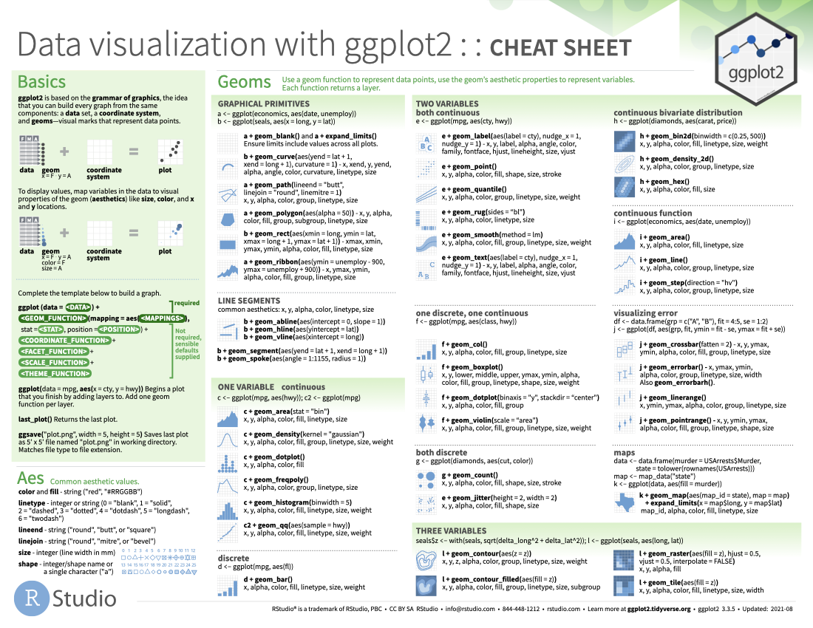
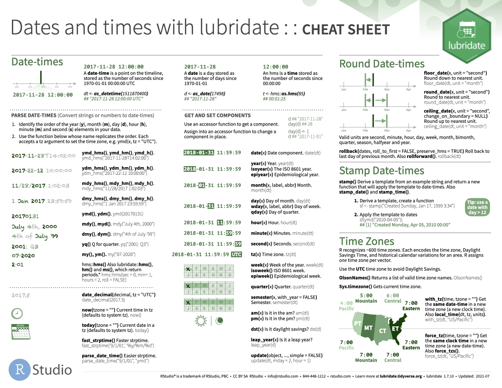
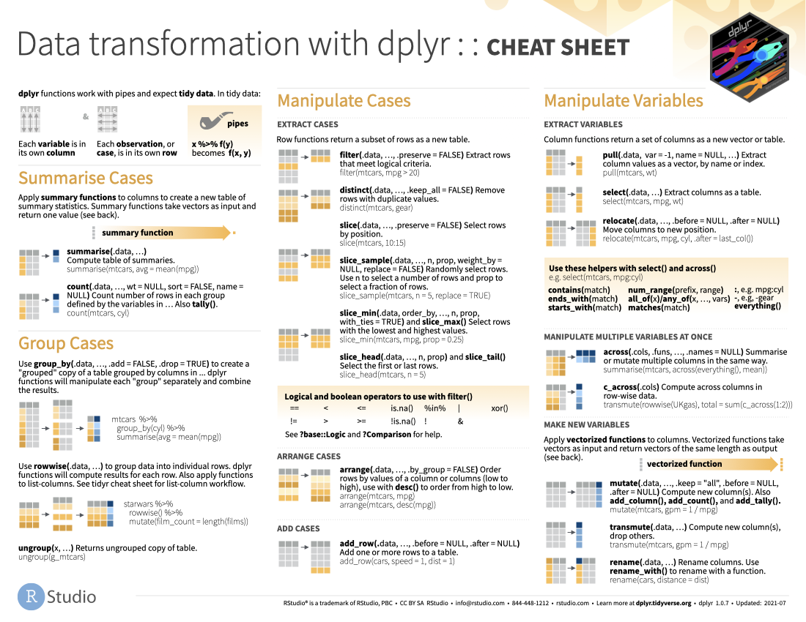
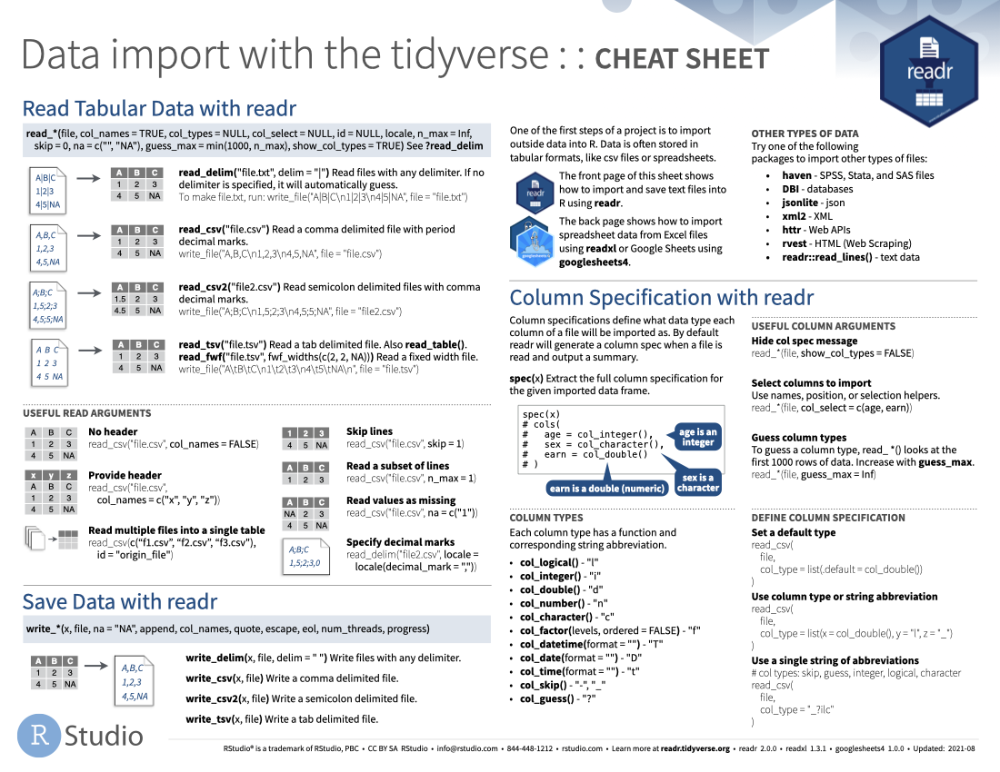
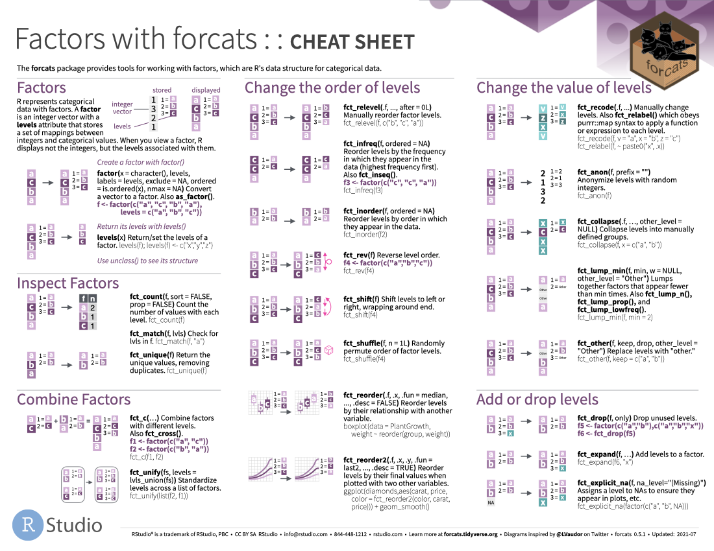
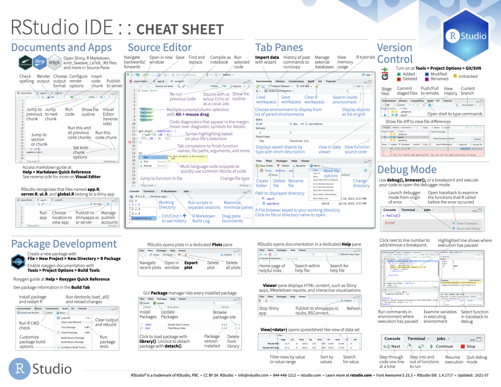

Les aide-mémoires suivants proviennent de <https://posit.co/resources/cheatsheets>. Nous n'avons pas couvert toutes les fonctions et fonctionnalités listées, mais vous pourriez les trouver utiles comme références.

::::: columns
::: {.column width="50%"}
[{fig-alt="ggplot2 cheat sheet" fig-align="left" width="300"}](https://raw.githubusercontent.com/rstudio/cheatsheets/main/data-visualization.pdf)

 

[{fig-alt="ggplot2 cheat sheet" fig-align="left" width="300"}](https://raw.githubusercontent.com/rstudio/cheatsheets/main/tidyr.pdf)

 

[{fig-alt="ggplot2 cheat sheet" fig-align="left" width="300"}](https://raw.githubusercontent.com/rstudio/cheatsheets/main/strings.pdf)

 

[{fig-alt="ggplot2 cheat sheet" fig-align="left" width="300"}](https://raw.githubusercontent.com/rstudio/cheatsheets/main/lubridate.pdf)
:::

::: {.column width="50%"}
[{fig-alt="ggplot2 cheat sheet" fig-align="right" width="300"}](https://raw.githubusercontent.com/rstudio/cheatsheets/main/data-transformation.pdf)

 

[{fig-alt="ggplot2 cheat sheet" fig-align="right" width="300"}](https://raw.githubusercontent.com/rstudio/cheatsheets/main/data-import.pdf)

 

[{fig-alt="ggplot2 cheat sheet" fig-align="right" width="300"}](https://raw.githubusercontent.com/rstudio/cheatsheets/main/factors.pdf)

 

[{fig-alt="ggplot2 cheat sheet" fig-align="right" width="300"}](https://raw.githubusercontent.com/rstudio/cheatsheets/main/rstudio-ide.pdf)
:::
:::::