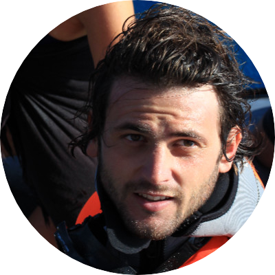
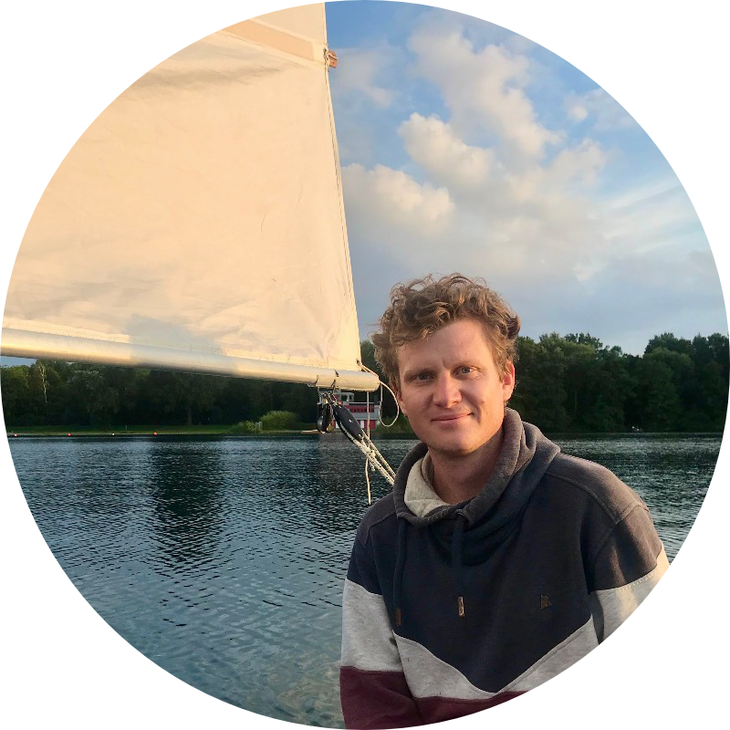

::: {.grid}

::: {.g-col-12 .g-col-md-6}

## Alexandre Merciere

{width="150px" style="border-radius: 50%; display: block; margin: 0 auto 1.5rem;"}

### Parcours

Ingénieur de recherche au CRIOBE

:::

::: {.g-col-12 .g-col-md-6}

## Andreas Eich

{width="150px" style="border-radius: 50%; display: block; margin: 0 auto 1.5rem;"}

### Parcours

Doctorant à EPHE (France), CRIOBE, et Université Laval (Canada)

:::

:::

::: {.columns}
::: {.column}
📧 [alexandre.merciere@vacataire.upf.pf](mailto:alexandre.merciere@vacataire.upf.pf)
:::
::: {.column}
📧 [andreas.eich@vacataire.upf.pf](mailto:andreas.eich@vacataire.upf.pf)
:::
:::

