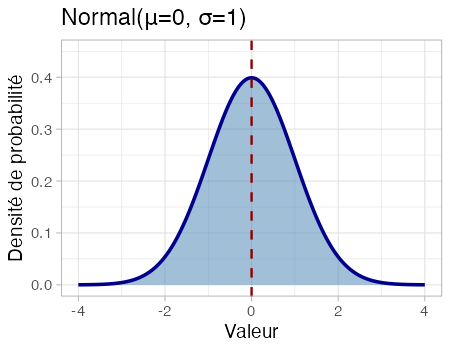
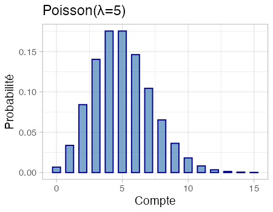
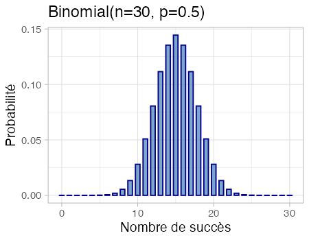
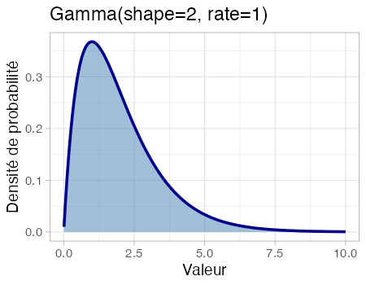

```{r}
#| message: false
#| warning: false
#| echo: false

library(tidyverse)
library(gt)

# Set theme
theme_set(theme_light(base_size = 14))
```

```{r}
#| message: false
#| warning: false
#| echo: false
#| include: false

# Define plot functions for each distribution

# Normal distribution
plot_normal <- function() {
  x <- seq(-4, 4, length.out = 200)
  df <- tibble(x = x, y = dnorm(x, mean = 0, sd = 1))

  ggplot(df, aes(x = x, y = y)) +
    geom_area(fill = "steelblue", alpha = 0.5) +
    geom_line(color = "darkblue", linewidth = 1.2) +
    geom_vline(
      xintercept = 0,
      linetype = "dashed",
      color = "darkred",
      linewidth = 0.8
    ) +
    labs(
      x = "Valeur",
      y = "Densité de probabilité",
      title = "Normal(μ=0, σ=1)"
    ) +
    ylim(0, 0.45) +
    theme(
      plot.margin = margin(2, 2, 2, 2, "mm"),
      panel.background = element_rect(fill = "transparent", color = NA),
      plot.background = element_rect(fill = "transparent", color = NA)
    )
}

# Poisson distribution
plot_poisson <- function() {
  x <- 0:15
  df <- tibble(x = x, y = dpois(x, lambda = 5))

  ggplot(df, aes(x = x, y = y)) +
    geom_col(fill = "steelblue", alpha = 0.7, width = 0.6, color = "darkblue") +
    labs(
      x = "Compte",
      y = "Probabilité",
      title = "Poisson(λ=5)"
    ) +
    theme(
      plot.margin = margin(2, 2, 2, 2, "mm"),
      panel.background = element_rect(fill = "transparent", color = NA),
      plot.background = element_rect(fill = "transparent", color = NA)
    )
}

# Binomial distribution
plot_binomial <- function() {
  x <- 0:30
  df <- tibble(x = x, y = dbinom(x, size = 30, prob = 0.5))

  ggplot(df, aes(x = x, y = y)) +
    geom_col(fill = "steelblue", alpha = 0.7, width = 0.6, color = "darkblue") +
    labs(
      x = "Nombre de succès",
      y = "Probabilité",
      title = "Binomial(n=30, p=0.5)"
    ) +
    theme(
      plot.margin = margin(2, 2, 2, 2, "mm"),
      panel.background = element_rect(fill = "transparent", color = NA),
      plot.background = element_rect(fill = "transparent", color = NA)
    )
}

# Gamma distribution
plot_gamma <- function() {
  x <- seq(0.01, 10, length.out = 200)
  df <- tibble(x = x, y = dgamma(x, shape = 2, rate = 1))

  ggplot(df, aes(x = x, y = y)) +
    geom_area(fill = "steelblue", alpha = 0.5) +
    geom_line(color = "darkblue", linewidth = 1.2) +
    labs(
      x = "Valeur",
      y = "Densité de probabilité",
      title = "Gamma(shape=2, rate=1)"
    ) +
    xlim(0, 10) +
    theme(
      plot.margin = margin(2, 2, 2, 2, "mm"),
      panel.background = element_rect(fill = "transparent", color = NA),
      plot.background = element_rect(fill = "transparent", color = NA)
    )
}

# Generate and save plots
p_normal <- plot_normal()
p_poisson <- plot_poisson()
p_binomial <- plot_binomial()
p_gamma <- plot_gamma()

# Create output directory if it doesn't exist
dir.create("images_summary", showWarnings = FALSE, recursive = TRUE)

# Save to output directory
ggsave(
  "images_summary/dist_normal.png",
  p_normal,
  width = 4.5,
  height = 3.5,
  dpi = 100
)
ggsave(
  "images_summary/dist_poisson.png",
  p_poisson,
  width = 4.5,
  height = 3.5,
  dpi = 100
)
ggsave(
  "images_summary/dist_binomial.png",
  p_binomial,
  width = 4.5,
  height = 3.5,
  dpi = 100
)
ggsave(
  "images_summary/dist_gamma.png",
  p_gamma,
  width = 4.5,
  height = 3.5,
  dpi = 100
)

invisible(NULL)
```

```{r}
#| echo: false
#| message: false

distributions_data <- tibble(
  Nom = c(
    "**Normale**",
    "**Poisson**",
    "**Binomiale**",
    "**Gamma**"
  ),
  Paramètres = c(
    "μ (moyenne)<br>σ (écart-type)",
    "λ (taux)",
    "n (essais)<br>p (probabilité)",
    "forme, taux"
  ),
  Description = c(
    "Courbe en cloche, symétrique. Définie sur $(-\\infty, +\\infty)$",
    "Distribution discrète. Comptes pics à λ, décroissance exponentielle",
    "Distribution discrète. Symétrique (p=0.5) ou asymétrique (p≠0.5)",
    "Continue, asymétrique à droite. Toujours positive"
  ),
  Propriétés = c(
    "Symétrique, variance constante. Moyenne = μ, Variance = σ²",
    "Variance = Moyenne = λ. Appropriée pour les événements rares et les comptes",
    "Discrète (0, 1, ..., n). Variance = np(1-p)",
    "Asymétrique à droite. Variance > Moyenne. Forme flexible"
  ),
  `Cas d'usage (Type de données)` = c(
    "Données continues sans limites naturelles (ex: mesures, différences)",
    "Données de comptage: nombre d'événements, abondance, occurrences",
    "Résultats binaires: présence/absence, succès/échec, vivant/mort",
    "Données positives continues: concentrations, biomasse, temps jusqu'à événement"
  ),
  Graphique = c(
    "{width=250px height=200px}",
    "{width=250px height=200px}",
    "{width=250px height=200px}",
    "{width=250px height=200px}"
  )
)

# Create the gt table
gt_table <- gt(distributions_data) %>%
  cols_width(
    Nom ~ pct(12),
    Paramètres ~ pct(12),
    Description ~ pct(18),
    Propriétés ~ pct(18),
    `Cas d'usage (Type de données)` ~ pct(18),
    Graphique ~ pct(22)
  ) %>%
  tab_options(
    table.width = pct(100),
    heading.background.color = "#e8e8e8",
    column_labels.background.color = "#f5f5f5",
    table.border.top.style = "solid",
    table.border.bottom.style = "solid",
    table.border.top.color = "#999",
    table.border.bottom.color = "#999",
    table.font.size = "12px"
  ) %>%
  tab_style(
    style = cell_text(align = "left", v_align = "top", size = "12px"),
    locations = cells_body()
  ) %>%
  tab_style(
    style = cell_text(weight = "bold", size = "12px"),
    locations = cells_column_labels()
  ) %>%
  tab_source_note(
    source_note = md(
      "Distributions standards utilisées dans les modèles linéaires généralisés (GLM) et la régression linéaire"
    )
  ) %>%
  fmt_markdown(columns = everything())

gt_table
```

