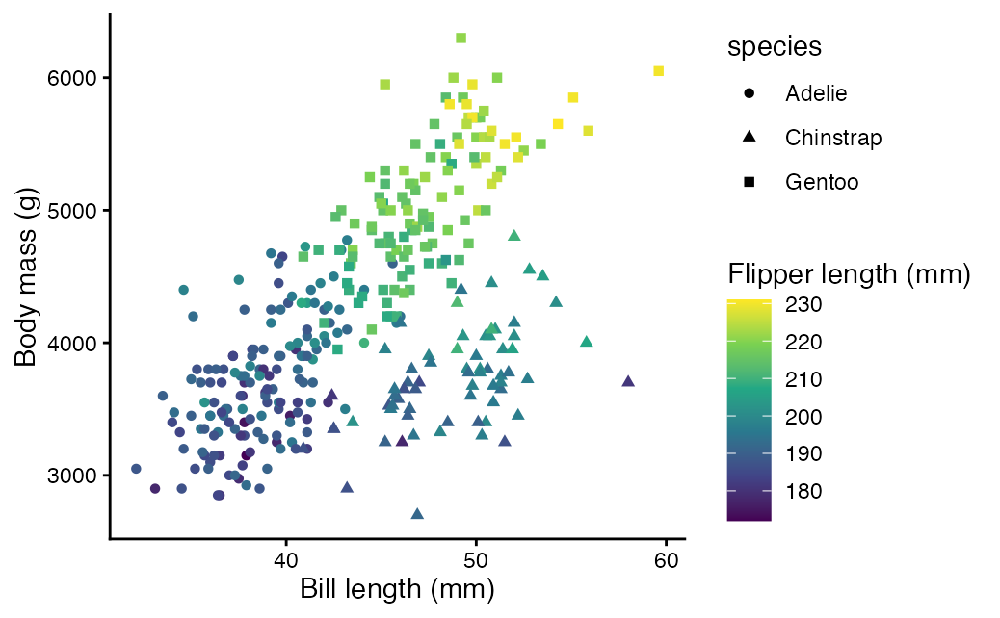
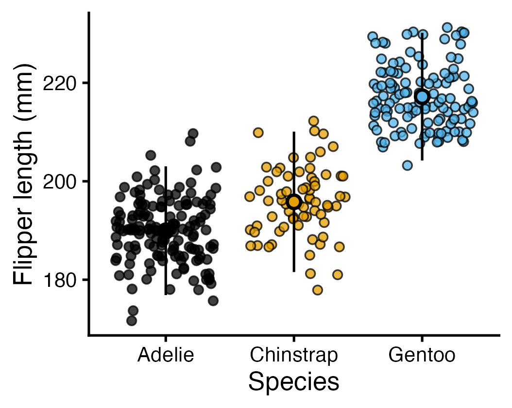

Here I give you some help in case you struggle solving the tasks. Please try to solve the tasks first without these hints, all information you need is in the `.qmd` document I shared with you.

:::: project
### Task 1

Use different themes for the plot we created just above. Here is a list of standard themes but there are many R packages that extend your choice:

```{r}
#| eval: false
#| echo: true

ggplot(
  data = penguins,
  aes(x = bill_length_mm, y = body_mass_g, colour = species)
) +
  geom_point() +
  labs(x = "Bill length (mm)", y = "Body mass (g)") +
  ____
```

::: {.callout-tip collapse="true" title="Show Hint"}
Replace the `____` part with one of the themes in the list I gave you.
:::
::::

:::: project
### Task 2

Replace the `____` below with a colour scale of your choice.

```{r}
#| eval: false
#| echo: true

ggplot(
  data = penguins,
  aes(x = bill_length_mm, y = body_mass_g, colour = species)
) +
  geom_point() +
  labs(x = "Bill length (mm)", y = "Body mass (g)") +
  ____
```

::: {.callout-tip collapse="true" title="Show Hint"}
Replace the `____` part with one of the colour scale examples I gave you, e.g. `scale_colour_colourblind()`.

If you want to use the "fully manual" colour scale, you could adapt it to something prettier like: `scale_colour_manual(values = c("darkorange", "darkgreen","aquamarine2"))`
:::
::::

:::: project
### Task 3

Take the plot we made above. Addditionally to different colours, use also different point shapes for the different species. Replace the `____` with the appropriate column name:

```{r}
#| eval: false
#| echo: true

ggplot(
  data = penguins,
  aes(x = bill_length_mm, y = body_mass_g, colour = species, shape = ____)
) +
  geom_point() +
  labs(x = "Bill length (mm)", y = "Body mass (g)") +
  theme_classic()
```

::: {.callout-tip collapse="true" title="Show Hint"}
Think about how you want to plot the data. As you have already used the species column to define the colour of the data points, you can use it in a similar way to define the shape of the data points. Just replace `____` with `species`.
:::
::::

:::: project
### Task 4

So far, we used categorical data for the different colours. What happens if you use a numerical variable to define the different colours? Replace the `____` below with a numeric column, e.g. `flipper_length_mm`. Remember to also update the labels used for the colour. Chnage the `____` in `labs()` for something useful. Remember that any text needs to be wrapped with `""`.

```{r}
#| eval: false
#| echo: true

ggplot(
  data = penguins,
  aes(x = bill_length_mm, y = body_mass_g, colour = ____, shape = species)
) +
  geom_point() +
  labs(x = "Bill length (mm)", y = "Body mass (g)", colour = ____) +
  scale_colour_viridis_c() +
  theme_classic()
```

::: {.callout-tip collapse="true" title="Show Hint"}
Above, you used the column `spiecies` for different colours, now, you are supposed to use the column `flipper_length_mm`. As a name for the legend (in `labs()`), you could use for example `"Flipper length (mm)"`.
:::
::::

:::: project
### Task 5

Take a look at the plot you just made. What is the relationship between the bill length, body mass, and flipper length?

{width="400" height="250"}

::: {.callout-tip collapse="true" title="Show Hint"}
First, look only at the scatter plot. Try to understand how the values on one axis impact the values at the other axis. In the big picture, have penguins with a large bill length also a high body mass? Now, try to include the colour coded flipper length. Are there any patterns in the colours of the points that are related either to the x or y axis? More explicit, does the flipper lenght increase with the bill lenght and/or the body mass?
:::
::::

:::: project
### Task 6

You can change the width of the bars. This can be useful, because each bar represents the frequency of a range of values (e.g. 5 mm steps). You can do this with the `bins` argument. Try out different values below and see what happens:

```{r}
#| eval: false
#| echo: true

ggplot(data = penguins, aes(x = bill_length_mm)) +
  geom_histogram(bins = ____) +
  theme_classic()
```

::: {.callout-tip collapse="true" title="Show Hint"}
What happens if you only use 1 or 2 bins? What happens if you use 100? 500? Replace the `____` with different values and see how the plot changes.
:::
::::

:::: project
### Task 7

Now plot in a similar way the island at which the penguins were observed. Use the `island` column.

```{r}
#| eval: false
#| echo: true

ggplot(data = penguins, aes(x = ____)) +
  geom_bar(stat = "count") +
  theme_classic()
```

::: {.callout-tip collapse="true" title="Show Hint"}
Again, think what you want to plot. You want to show a barplot with the frequency of islands on the y axis (calculated automatically) and the level of the island (e.g. Torgersen or Biscoe) on the x axis. Therefore, you have to give `island` as the x-axis.
:::
::::

:::: project
### Task 8

In this plot, the point represents the mean, and the line the standard deviation. Doing this for data grouped by island is not very useful. Adapt the plot below so that it shows the flipper length grouped by species:

```{r}
#| eval: false
#| echo: true

ggplot(data = penguins, aes(x = ____, y = flipper_length_mm)) +
  geom_pointrange(stat = "summary", fun.data = mean_sdl) +
  theme_classic()
```

::: {.callout-tip collapse="true" title="Show Hint"}
Replace the `____` with `species`.
:::
::::

:::: project
### Task 9

What happens if you don't use `geom_jitter()` but the "standard" `geom_point()`? Try it out below:

```{r}
#| eval: false
#| echo: true

ggplot(data = penguins, aes(x = species, y = flipper_length_mm)) +
  ____(alpha = .4) +
  geom_pointrange(stat = "summary", fun.data = mean_sdl) +
  theme_classic()
```

::: {.callout-tip collapse="true" title="Show Hint"}
You want to use a "normal" `geom_point()`. The second line will be: `geom_point(alpha = .4) +`.

Is the resulting plot useful? Why? How could it be improved?
:::
::::

:::: project
### Task 10

As a last step, try to customise the plot so that you archive something similar as this one. Think about which column is used for what.

{width="400"}

Here is the "base" plot as a starting point:

```{r}
#| eval: false
#| echo: true

ggplot(data = penguins, aes(x = species, y = flipper_length_mm)) +
  geom_jitter(alpha = .4) +
  geom_pointrange(stat = "summary", fun.data = mean_sdl) +
  theme_classic()
```

::: {.callout-tip collapse="true" title="Show Hint"}
One possible solution is this:

```{r}
#| eval: false
#| echo: true

ggplot(
  data = penguins,
  aes(x = species, y = flipper_length_mm, fill = species),
) +
  geom_jitter(alpha = .75, shape = 21) +
  geom_pointrange(
    stat = "summary",
    fun.data = mean_sdl,
    show.legend = F,
    shape = 21
  ) +
  labs(
    x = "Species",
    y = "Flipper length (mm)"
  ) +
  scale_color_colorblind() +
  scale_fill_colorblind() +
  theme_classic(base_size = 20) +
  theme(legend.position = "none")
```
:::
::::

