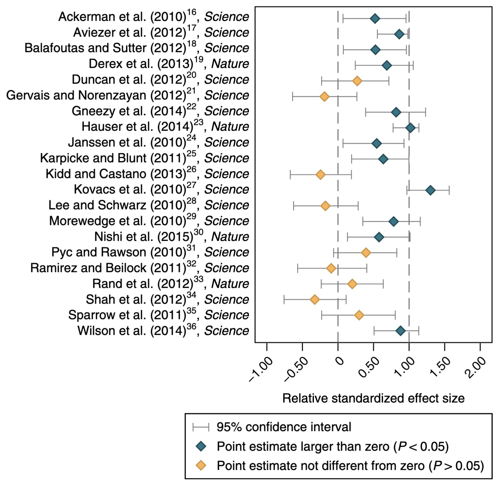
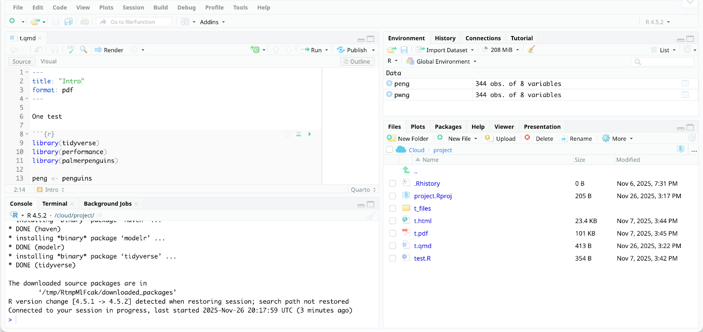
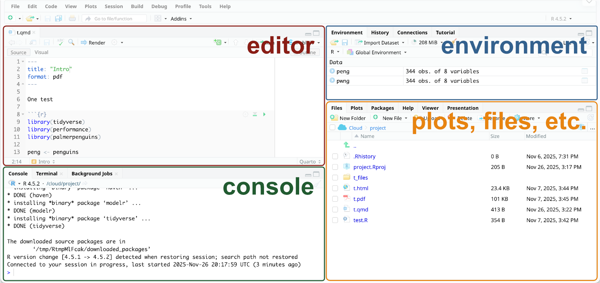
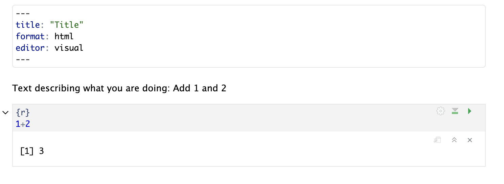

## À propos de moi {.smaller}

::: med-space
:::

-   Doctorant à l'EPHE (Paris), CRIOBE (Mo'orea), et Université Laval (Canada)
-   Travail sur les motifs moléculaires responsables des différences de tolérance thermique du corail
-   Toujours en train d'apprendre le français, soyez patients

## Format du cours {.smaller}

::: med-space
:::

-   7 × 1,5 heures
-   Env. 30 minutes d'introduction (présentation), 1 heure d'exercices
-   Toutes les informations du cours sur le site du cours (diapositives, dates, annonces, etc.)
-   2 examens, 1,5 heure chacun, plus une deuxième chance

## Statistiques {.smaller}

::: med-space
:::

-   Transformez les données brutes en compréhension, aperçu et connaissances
-   Aide à comprendre la variation
-   Partie importante d'un bon flux de travail scientifique, de la documentation et de la communication
-   Nécessaire pour tous les domaines de la biologie

## Crise de la réplication {.smaller}

::: med-space
:::

::::: columns
::: column

:::

::: column
Mêmes données, équipes différentes [@camerer2018]
:::
:::::

## Objectif {.smaller}

::: med-space
:::

-   Comprendre et **appliquer** les méthodes statistiques pour analyser vos données (mémoires de BSc & MSc)
-   Comprendre les idées principales des analyses dans les publications scientifiques
-   Rendre les analyses ouvertes et reproductibles
-   **Pensée statistique :** Comprendre les causes biologiques de la variation dans les données, plutôt que de se concentrer sur les valeurs p et des dizaines de tests

## Approche {.smaller}

::: med-space
:::

-   Accent sur les statistiques appliquées et modernes
-   Analyses « tidy » (plus sur cela plus tard)
-   Travail avec de vraies données
-   Les modèles statistiques comme cadre unifié

## Pourquoi analyser avec du code ? {.smaller}

::: med-space
:::


-   Les scripts documentent toutes les étapes effectuées
-   Les programmes à clics (par ex. Excel) cachent le flux de travail → Non reproductible
-   Écrire du code nécessite de réfléchir à vos données et aux étapes d'analyse étape par étape
-   Les programmes automatiques cachent ce qui se passe réellement

## Éviter Excel {.small}

::: med-space
:::


-   Considère « tout » comme une date
-   20 % des articles de génétique contiennent des erreurs dues au formatage Excel [@ziemann2016]
-   Les gènes ont été renommés parce que c'est plus facile que de gérer Excel
-   Format de fichier propriétaire (Microsoft) → Vous devez acheter le programme pour l'ouvrir, problèmes de compatibilité
-   Utile pour entrer des données (mais envisager Google Sheets, OpenOffice, etc.)

::: question
Excel est excellent pour entrer des données, mais pas pour l'analyse
:::

## Pourquoi R ?  {.smaller}

::: med-space
:::


-   Gratuit
-   Conçu pour les statistiques
-   Développement constant
-   Extensible avec des paquets
-   Communauté en ligne et bon support
-   Standard en biologie

## Travailler en R  {.smaller}

::: med-space
:::

-   Vous n'avez pas besoin de mémoriser tout le code
-   Les messages d'erreur et les avertissements sont normaux et font partie du processus d'apprentissage
-   Vous n'avez pas besoin de tout comprendre aujourd'hui, vous comprendrez davantage à chaque séance


## Outils utilisés dans le cours {.small}

::: med-space
:::

:::::: columns
::: {.column width="33%"}
{fig-alt="Logo R" fig-align="left" height="100"}

Langage de programmation
:::

::: {.column width="33%"}
{fig-alt="Logo RStudio" fig-align="left" height="100"}

Interface pratique pour R
:::

::: {.column width="33%"}
{fig-alt="Logo Quarto" fig-align="left" height="100"}

Combine le texte, le code et la sortie (graphiques, tableaux, ...)
:::
::::::

:::::: columns
::: {.column width="33%"}
→ *Langage*
:::

::: {.column width="33%"}
→ *Traitement de texte*
:::

::: {.column width="33%"}
→ *Document `.docx`*
:::
::::::

## Aperçu de R {.small}

::: med-space
:::

```{r}
#| echo: false

library(palmerpenguins)
library(tidyverse)
```

### Objets

*Données, colonnes, vecteurs, etc.*

```{r}
#| eval: false
#| echo: true

penguins # données
penguins$species # colonne

a <- 1 # sauvegarde la valeur 1 dans l'objet nommé `a`
b <- "Bonjour" # R peut stocker les nombres ET le texte
```

::: med-space
:::

### Fonctions

*Faire quelque chose, souvent avec des objets*

```{r}
#| eval: false
#| echo: true

str(penguins) # aperçu

penguins %>% # prendre les données
  filter(species == "Adelie") %>% # puis filtrer pour une espèce
  mutate(bill_length_cm = bill_length_mm / 10) # puis créer une nouvelle colonne
```

`#` introduit un commentaire

## Visite rapide de RStudio  {.smaller}

::: med-space
:::



## Visite rapide de RStudio  {.smaller}

::: med-space
:::



## Visite rapide de RStudio {.smaller}

::: med-space
:::

-   Installation très facile (mais pas sur les ordinateurs UPF)
-   Utilisez « Posit Cloud », une version en ligne de RStudio (fonctionne aussi sur les tablettes)
-   Je mets à disposition les feuilles de tâches chaque semaine
-   25 heures/mois gratuitement → fermez la session après utilisation
-   Si vous voulez utiliser votre propre ordinateur, parlez-moi

## Aperçu de Quarto {.smaller}

::: med-space
:::
 
-   Permet de combiner du texte (expliquant l'analyse, les étapes que vous avez prises, etc.), du code et la sortie (graphiques, tableaux, etc.)
-   Peut être exporté en HTML (site web), PDF, document MS Word
-   Très bon pour documenter votre travail et rendre les analyses reproductibles

## Aperçu de Quarto {.smaller}

::: med-space
:::



## Paquets {.small}

::: med-space
:::

Collection de fonctions qui étendent R

::: med-space
:::

:::::: columns
::: {.column width="50%"}
### Exemples

-   `readxl` pour lire les fichiers Excel
-   `googlesheets4` pour lire Google Sheets
:::

:::: {.column width="50%"}
::: fragment 
### Installation

```{r}
#| eval: false
#| echo: true

install.packages("tidyverse")
```

Vous installez un paquet une seule fois
:::
::: med-space
:::

::: fragment 

### Chargement

```{r}
#| eval: false
#| echo: true

library(tidyverse)
```

Vous le chargez (`library()`) chaque fois que vous démarrez R
:::
::::
::::::

## À vous de jouer  {.smaller}

::: med-space
:::

1.  Allez sur le site du cours
2.  Allez au calendrier
3.  Cliquez sur `TP1`
4.  Connectez-vous à Posit Cloud

::: huge
::: center-align

[andieich.github.io/2026_biostatistiques_2](andieich.github.io/2026_biostatistiques_2)

:::
:::


## Références