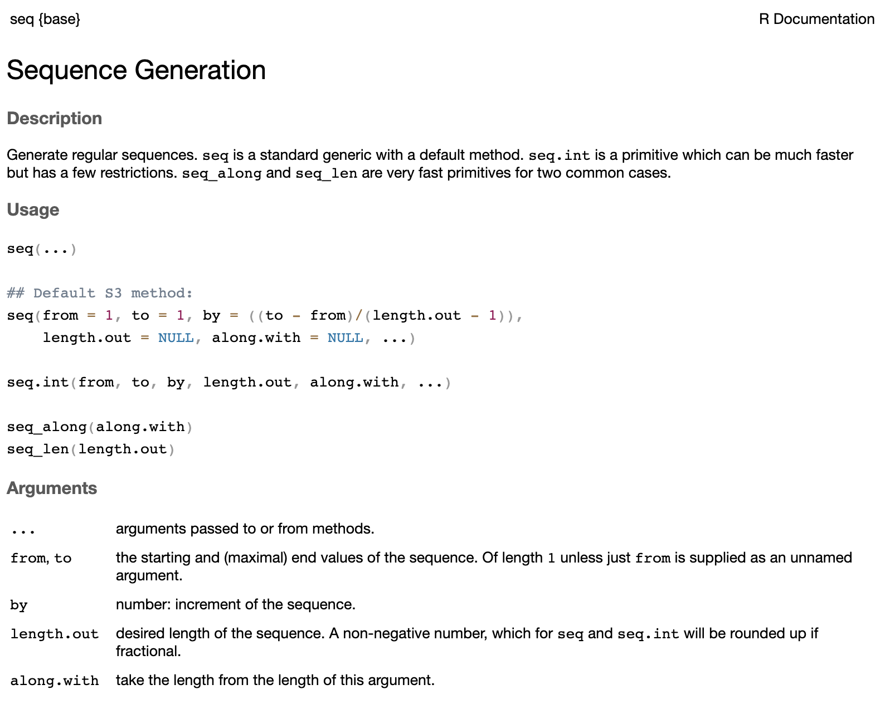
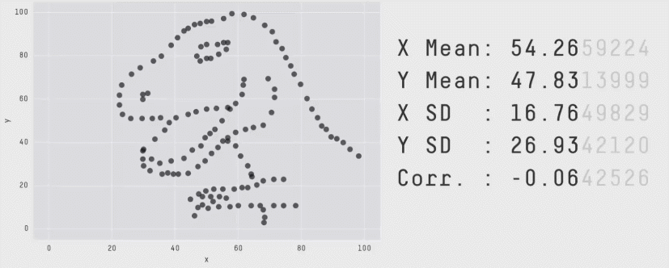
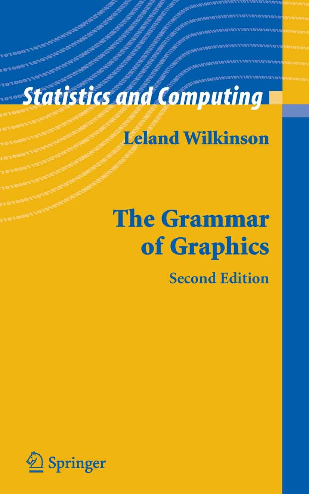
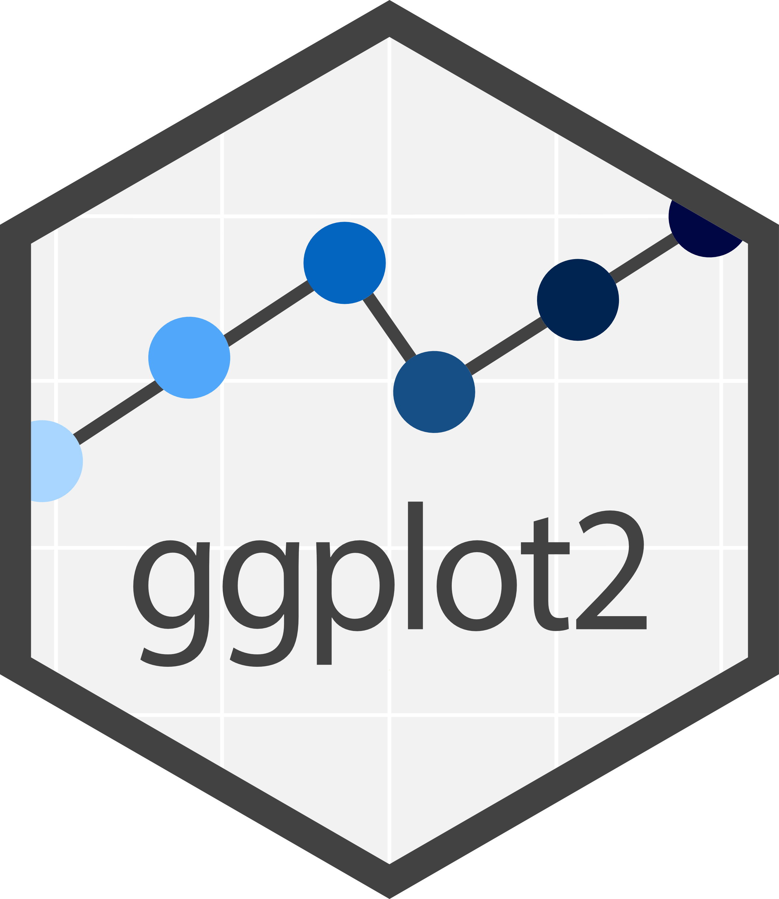
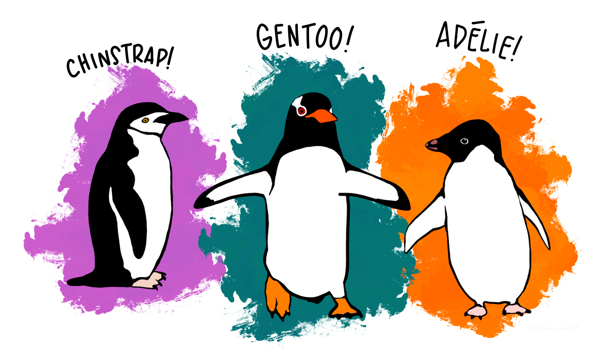
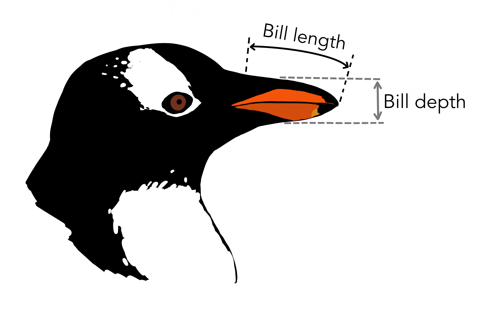

```{r}
#| echo: false

library(datasauRus)
library(palmerpenguins)
library(gt)
library(gtExtras)
library(tidyverse)
penguins <- penguins %>%
  na.omit()
```

## Résumé du cours précédent

-   Introduction à R
-   Qu'est-ce que les objets et les fonctions ?
-   Résumés de base des données
-   Différents types de données

## Données « tidy » {.small}

::: med-space
:::

-   Une **variable** est une quantité, une qualité ou une propriété que vous pouvez mesurer. 
    
    *Exemple : Longueur de la nageoire*

::: incremental


-   Une **valeur** est l'état d'une variable lorsque vous la mesurez. La valeur d'une variable peut changer d'une mesure à l'autre. 
    
    *Exemple : longueur des nageoires du manchot 1 = 181 mm*
:::


## Données « tidy » {.small}
::: med-space
:::


-   Une **observation** est un ensemble de mesures effectuées dans des conditions similaires. Une observation contient plusieurs valeurs, chacune étant associée à une variable différente. 
    
    *Exemple: une ligne dans les données des manchots pour la longueur du bec, la longueur de la nageoire, la masse corporelle, etc. d'un manchot*

::: incremental

-   Les **données tabulaires** sont un ensemble de valeurs, chacune étant associée à une variable et à une observation. Les données tabulaires sont « tidy » si chaque valeur est placée dans sa propre « cellule », chaque variable dans sa propre colonne et chaque observation dans sa propre ligne.
:::


## Données « tidy » {.small}
::: med-space
:::


1.  Chaque variable doit avoir sa propre colonne

2.  Chaque observation doit avoir sa propre ligne

3.  Chaque valeur doit avoir sa propre cellule


## Fonctions R

Les fonctions prennent des *arguments* en entrée. Ils peuvent être nommés :

```{r}
#| echo: true

mean(x = penguins$bill_length_mm)

```

::: med-space
:::

Ou non nommés :

```{r}
#| echo: true

mean(penguins$bill_length_mm)

```

## Fonctions R

::: med-space
:::

::::: {.columns .small}
:::: column
::: project
Certaines fonctions prennent plusieurs arguments

```{r}
#| echo: true

seq(from = 1, to = 5)
```

:::
::::

::::: column
:::: {.fragment fragment-index="2"}
::: project
L'ordre peut être modifié avec des arguments nommés

```{r}
#| echo: true

seq(to = 5, from = 1)
```

:::
::::
:::::
::::::::

::: med-space
:::

::::::::: {.columns .small}
::::: column
:::: {.fragment fragment-index="1"}
::: project
Si non nommés, l'ordre par défaut est supposé

```{r}
#| echo: true

seq(1, 5)
```

:::
::::
:::::

::::: column
:::: {.fragment fragment-index="3"}
::: project
Mais maintenant, R comprend : Séquence de 5 à 1 :

```{r}
#| echo: true

seq(5, 1)
```

:::
::::
:::::

:::::::::

::: med-space
:::

::::: {.fragment fragment-index="4"}
:::: question
::: xsmall
Utilisez des arguments nommés pour rendre le code plus clair
:::
::::
:::::

## Fonctions R

::::: columns
::: {.column .small width="40%"}
Read the documentation of a function by running\
`?function_name`

```{r}
#| echo: true
#| eval: false

?seq
```

:::

::: {.column width="60%"}

:::
:::::

## Pourquoi visualiser ?

::: med-space
:::

::::: columns
::: column

### Données brutes

```{r}
datasaurus_dozen %>%
  select(-dataset) %>%
  head(15) %>%
  gt() %>%
  gt_theme_pff()
```

:::

::: column
### Résumé

```{r} 
datasaurus_dozen_dino <- datasaurus_dozen %>%
  filter(dataset == "dino")

c(
  `X Mean` = mean(datasaurus_dozen_dino$x),
  `Y Mean` = mean(datasaurus_dozen_dino$y),
  `X SD` = sd(datasaurus_dozen_dino$x),
  `Y SD` = sd(datasaurus_dozen_dino$y),
  Corr = cor(datasaurus_dozen_dino$x, datasaurus_dozen_dino$y)
) %>%
  enframe(name = "metric", value = "value") %>%
  gt() %>%
  fmt_number(columns = value, decimals = 2, use_seps = FALSE) %>%
  tab_options(
    data_row.padding = px(1),
    table.font.size = 44,
    table.width = "auto"
  ) %>%
  gt_theme_nytimes() %>%
  tab_options(column_labels.hidden = TRUE) %>%
  tab_style(
    style = cell_text(weight = "bold"),
    locations = cells_body(columns = metric)
  )

```


:::
:::::

## Pourquoi visualiser ?



## "Grammaire des graphiques"

::: med-space
:::

::::: columns
::: {.column width="30%"}
{height="300" fig-align="center"} {height="150" fig-align="center"}
:::

::: {.column width="70%"}
### Esthétique

-   Propriété visuelle d'un graphique
-   Position, forme, couleur, etc.

### Données

-   Une colonne dans un jeu de données
:::
:::::

## Associer les données aux esthétiques

::: med-space
:::

::::: columns
::: {.column width="40%"}
 
:::

::: {.column width="60%"}

```{r} 
#| echo: false

penguins %>%
  head(28) %>%
  gt() %>%
  gt_theme_excel() %>%
  tab_options(
    data_row.padding = px(1),
    table.font.size = 12,
    table.width = "auto"
  )
```

:::
:::::

## Associer les données aux esthétiques {auto-animate="true" auto-animate-easing="ease-in-out"}

::: med-space
:::

::::: columns
::: {.column width="40%"}
 
:::

::: {.column width="60%"}
```{r} 
#| fig-height: 10

penguins %>%
  ggplot(aes(x = bill_length_mm, y = body_mass_g, col = species)) +
  geom_point() +
  theme_grey(base_size = 20)
```

:::
:::::

## Associer les données aux esthétiques

::: med-space
:::

:::::: columns
:::: {.column width="60%"}
::: xsmall
| Données           | Esthétique        | Géométrie |
|-------------|-------------------|----------|
| Longueur du bec   | Position (axe-x)  | Point    |
| Masse corporelle  | Position (axe-y)  | Point    |
| Espèce            | Couleur           | Point    |
:::
::::

::: {.column width="40%"}
```{r} 
#| fig-height: 10

penguins %>%
  ggplot(aes(x = bill_length_mm, y = body_mass_g, col = species)) +
  geom_point() +
  theme_grey(base_size = 20)
```

  
:::
::::::

## Associer les données aux esthétiques

::: med-space
:::

:::::: columns
:::: {.column width="60%"}
::: xsmall
| Data             | `aes()`  | `geom`         |
|------------------|----------|----------------|
| `bill_length_mm` | `x`      | `geom_point()` |
| `body_mass_g`    | `y`      | `geom_point()` |
| `species`        | `colour` | `geom_point()` |
:::
::::

::: {.column width="40%"}
```{r} 
#| fig-height: 10

penguins %>%
  ggplot(aes(x = bill_length_mm, y = body_mass_g, col = species)) +
  geom_point() +
  theme_grey(base_size = 20)
```


:::
::::::

## `ggplot()`

::: med-space
:::

::::::: columns
::::: column
::: small
Configurer les données et les esthétiques
:::

::: small
```{r} 
#| echo: true
#| eval: false
# fmt: skip

ggplot(data = penguins, 
       mapping = aes(x = bill_length_mm, 
                     y = body_mass_g, 
                     color = species))
```

:::
:::::

::: column
```{r} 
#| fig-height: 10
#| warning: false

ggplot(
  data = penguins,
  mapping = aes(x = bill_length_mm, y = body_mass_g, color = species)
) +
  theme_grey(base_size = 20)

```

:::
:::::::

## `ggplot()`

::: med-space
:::

::::::: columns
::::: column
::: small
Ajouter "geom"
:::

::: small
```{r} 
#| echo: true
#| eval: false

# fmt: skip

ggplot(data = penguins, 
       mapping = aes(x = bill_length_mm, 
                     y = body_mass_g, 
                     color = species)) + 
  geom_point()

```


:::
:::::

::: column
```{r} 
#| fig-height: 10
#| warning: false

ggplot(
  data = penguins,
  mapping = aes(x = bill_length_mm, y = body_mass_g, color = species)
) +
  geom_point() +
  theme_grey(base_size = 20)
```

:::
:::::::

## `ggplot()`

::: med-space
:::

::::::: columns
::::: column
::: small
Utiliser des couleurs personnalisées
:::

::: small
```{r} 
#| echo: true
#| eval: false

# fmt: skip

ggplot(data = penguins, 
       mapping = aes(x = bill_length_mm, 
                     y = body_mass_g, 
                     color = species)) + 
  geom_point() +
  scale_colour_manual(values = c("darkgreen", 
                                 "darkblue", 
                                 "darkred"))
```


:::
:::::

::: column
```{r} 
#| fig-height: 10
#| warning: false

ggplot(
  data = penguins,
  mapping = aes(x = bill_length_mm, y = body_mass_g, color = species)
) +
  geom_point() +
  theme_grey(base_size = 20) +
  scale_colour_manual(values = c("darkgreen", "darkblue", "darkred")) +
  theme_grey(base_size = 20)

```

:::
:::::::

## `ggplot()`

::: med-space
:::

::::::: columns
::::: column
::: small
Utiliser des couleurs personnalisées
:::

::: small
```{r} 
#| echo: true
#| eval: false

# fmt: skip

ggplot(data = penguins, 
       mapping = aes(x = bill_length_mm, 
                     y = body_mass_g, 
                     color = species)) + 
  geom_point() +
  scale_color_viridis_d()
```


:::
:::::

::: column
```{r} 
#| fig-height: 10
#| warning: false

ggplot(
  data = penguins,
  mapping = aes(x = bill_length_mm, y = body_mass_g, color = species)
) +
  geom_point() +
  theme_grey(base_size = 20) +
  scale_color_viridis_d() +
  theme_grey(base_size = 20)

```

:::
:::::::

## `ggplot()`

::: med-space
:::

::::::: columns
::::: column
::: small
Étiquettes
:::

::: small
```{r} 
#| echo: true
#| eval: false

# fmt: skip

ggplot(data = penguins, 
       mapping = aes(x = bill_length_mm, 
                     y = body_mass_g, 
                     color = species)) + 
  geom_point() +
  scale_color_viridis_d() + 
  labs(x = "Longueur du bec (mm)", 
       y = "Masse corporelle (g)", 
       colour = "Espèce")
```

:::
:::::

::: column
```{r} 
#| fig-height: 10
#| warning: false

ggplot(
  data = penguins,
  mapping = aes(x = bill_length_mm, y = body_mass_g, color = species)
) +
  geom_point() +
  theme_grey(base_size = 20) +
  scale_color_viridis_d() +
  labs(
    x = "Longueur du bec (mm)",
    y = "Masse corporelle (g)",
    colour = "Espèce"
  ) +
  theme_grey(base_size = 20)
```

:::
:::::::

## `ggplot()`

::: med-space
:::

::::::: columns
::::: column
::: small
Changer le style
:::

::: small
```{r} 
#| echo: true
#| eval: false

# fmt: skip

ggplot(data = penguins, 
       mapping = aes(x = bill_length_mm, 
                     y = body_mass_g, 
                     color = species)) +
  geom_point() + 
  scale_color_viridis_d() + 
  labs(x = "Longueur du bec (mm)", 
       y = "Masse corporelle (g)", 
       colour = "Espèce") + 
  theme_light()
```

:::
:::::

::: column
```{r} 
#| fig-height: 10
#| warning: false

ggplot(
  data = penguins,
  mapping = aes(x = bill_length_mm, y = body_mass_g, color = species)
) +
  geom_point() +
  scale_color_viridis_d() +
  labs(
    x = "Longueur du bec (mm)",
    y = "Masse corporelle (g)",
    colour = "Espèce"
  ) +
  theme_light(base_size = 20)

```

:::
:::::::

## `ggplot()`

::: med-space
:::

::::::: columns
::::: column
::: small
Changer le style
:::

::: small
```{r} 
#| echo: true
#| eval: false

# fmt: skip

ggplot(data = penguins, 
       mapping = aes(x = bill_length_mm, 
                     y = body_mass_g, 
                     color = species)) +
  geom_point() + 
  scale_color_viridis_d() + 
  labs(x = "Longueur du bec (mm)", 
       y = "Masse corporelle (g)", 
       colour = "Espèce") + 
  theme_classic()
```

:::
:::::

::: column
```{r} 
#| fig-height: 10
#| warning: false

ggplot(
  data = penguins,
  mapping = aes(x = bill_length_mm, y = body_mass_g, color = species)
) +
  geom_point() +
  scale_color_viridis_d() +
  labs(
    x = "Longueur du bec (mm)",
    y = "Masse corporelle (g)",
    colour = "Espèce"
  ) +
  theme_classic(base_size = 20)

```

:::
:::::::

## `ggplot()`

::: med-space
:::

::::::: columns
::::: column
::: small
Changer le style
:::

::: small
```{r} 
#| echo: true
#| eval: false

# fmt: skip

ggplot(data = penguins, 
       mapping = aes(x = bill_length_mm, 
                     y = body_mass_g, 
                     color = species)) +
  geom_point() + 
  scale_color_viridis_d() + 
  labs(x = "Longueur du bec (mm)", 
       y = "Masse corporelle (g)", 
       colour = "Espèce") + 
  theme_classic() + 
  theme(legend.position = "bottom")
```

:::
:::::

::: column
```{r} 
#| fig-height: 10
#| warning: false

ggplot(
  data = penguins,
  mapping = aes(x = bill_length_mm, y = body_mass_g, color = species)
) +
  geom_point() +
  scale_color_viridis_d() +
  labs(
    x = "Longueur du bec (mm)",
    y = "Masse corporelle (g)",
    colour = "Espèce"
  ) +
  theme_classic(base_size = 20) +
  theme(legend.position = "bottom")

```

:::
:::::::

## `ggplot()`

::: med-space
:::

::::::::: columns
::::::: column
::::: small
::: small
| Data             | `aes()`  | `geom`         |
|------------------|----------|----------------|
| `bill_length_mm` | `x`      | `geom_point()` |
| `body_mass_g`    | `y`      | `geom_point()` |
| `species`        | `colour` | `geom_point()` |
| `species`        | `shape`  | `geom_point()` |
:::

::: med-space
:::
:::::

::: small
```{r} 
#| echo: true
#| eval: false

# fmt: skip

ggplot(data = penguins, 
       mapping = aes(x = bill_length_mm, 
                     y = body_mass_g, 
                     color = species, 
                     shape = species)) + 
  geom_point() + 
  scale_color_viridis_d() + 
  labs(x = "Longueur du bec (mm)", 
       y = "Masse corporelle (g)", 
       colour = "Espèce",
       shape = "Espèce") + 
  theme_classic()
```

:::
:::::::

::: column
```{r} 
#| fig-height: 10
#| warning: false

ggplot(
  data = penguins,
  mapping = aes(
    x = bill_length_mm,
    y = body_mass_g,
    color = species,
    shape = species
  )
) +
  geom_point() +
  scale_color_viridis_d() +
  labs(
    x = "Longueur du bec (mm)",
    y = "Masse corporelle (g)",
    colour = "Espèce",
    shape = "Espèce"
  ) +
  theme_classic(base_size = 20)
```

:::
:::::::::

## Autres visualisations

::: med-space
:::

::::::::: columns
::::::: column
::::: small
::: small
| Data          | `aes()`  | `geom`           |
|---------------|----------|------------------|
| `species`     | `x`      | `geom_boxplot()` |
| `body_mass_g` | `y`      | `geom_boxplot()` |
| `species`     | `colour` | `geom_boxplot()` |
:::

::: med-space
:::
:::::

::: small
```{r} 
#| echo: true
#| eval: false

# fmt: skip

ggplot(data = penguins, 
       mapping = aes(x = species, 
                     y = body_mass_g, 
                     color = species)) + 
  geom_boxplot() + 
  scale_color_viridis_d() + 
  labs(x = "Longueur du bec (mm)", 
       y = "Masse corporelle (g)", 
       colour = "Espèce") + 
  theme_classic() + 
  theme(legend.position = "bottom")
```


:::
:::::::

::: column
```{r} 
#| fig-height: 10
#| warning: false

ggplot(
  data = penguins,
  mapping = aes(x = species, y = body_mass_g, color = species)
) +
  geom_boxplot() +
  scale_color_viridis_d() +
  labs(
    x = "Longueur du bec (mm)",
    y = "Masse corporelle (g)",
    colour = "Espèce"
  ) +
  theme_classic(base_size = 20) +
  theme(legend.position = "bottom")

```

:::
:::::::::

## Autres visualisations

::: med-space
:::

::::::: columns
::::: column
::: small
Combiner les graphiques
:::

::: small
```{r} 
#| echo: true
#| eval: false

# fmt: skip

ggplot(data = penguins,
       mapping = aes(x = species, 
                     y = body_mass_g, 
                     color = species)) + 
  geom_boxplot() + 
  geom_jitter() + 
  scale_color_viridis_d() + 
  labs(x = "Longueur du bec (mm)", 
       y = "Masse corporelle (g)", 
       colour = "Espèce") + 
  theme_classic() + 
  theme(legend.position = "bottom")
```

:::
:::::

::: column
```{r} 
#| fig-height: 10
#| warning: false

ggplot(
  data = penguins,
  mapping = aes(x = species, y = body_mass_g, color = species)
) +
  geom_boxplot() +
  geom_jitter() +
  scale_color_viridis_d() +
  labs(
    x = "Longueur du bec (mm)",
    y = "Masse corporelle (g)",
    colour = "Espèce"
  ) +
  theme_classic(base_size = 20) +
  theme(legend.position = "bottom")

```

:::
:::::::

## Autres visualisations

::: med-space
:::

::::::: columns
::::: column
::: small
Combiner les graphiques
:::

::: small
```{r} 
#| echo: true
#| eval: false

# fmt: skip

ggplot(data = penguins, 
       mapping = aes(x = species, 
                     y = body_mass_g, 
                     color = species,
                     fill = species)) + 
  geom_jitter() +
  geom_violin(alpha = .5) +
  scale_color_viridis_d() +
  scale_fill_viridis_d() +
  labs(x = "Longueur du bec (mm)", 
       y = "Masse corporelle (g)", 
       colour = "Espèce",
       fill = "Espèce") + 
  theme_classic() + 
  theme(legend.position = "bottom")
```


:::
:::::

::: column
```{r} 
#| fig-height: 10
#| warning: false

ggplot(
  data = penguins,
  mapping = aes(x = species, y = body_mass_g, color = species, fill = species)
) +
  geom_jitter() +
  geom_violin(alpha = .5) +
  scale_color_viridis_d() +
  scale_fill_viridis_d() +
  labs(
    x = "Longueur du bec (mm)",
    y = "Masse corporelle (g)",
    colour = "Espèce",
    fill = "Espèce"
  ) +
  theme_classic(base_size = 20) +
  theme(legend.position = "bottom")
```

:::
:::::::


## Exemples : Uniquement des valeurs numériques

```{r}
penguins %>%
  ggplot(aes(x = bill_length_mm)) +
  geom_histogram() +
  labs(
    x = "Longueur du bec (mm)",
    y = "Fréquence"
  ) +
  theme_classic(base_size = 20)
```


## Exemples : Uniquement des valeurs numériques

::: med-space
:::


```{r}
penguins %>%
  ggplot(aes(x = bill_length_mm)) +
  geom_density() +
  labs(
    x = "Longueur du bec (mm)",
    y = "Densité"
  ) +
  theme_classic(base_size = 20)
```

## Exemples : Uniquement des valeurs catégorielles

::: med-space
:::

```{r}
penguins %>%
  ggplot(aes(x = species)) +
  geom_bar(stat = "count") +
  labs(
    x = "Espèce",
    y = "Nombre"
  ) +
  theme_classic(base_size = 20)
```


## Exemples : Valeurs numériques et catégorielles

::: med-space
:::

```{r}
penguins %>%
  ggplot(aes(x = species, y = flipper_length_mm)) +
  geom_bar(stat = "summary", fun = "mean") +
  labs(
    x = "Espèce",
    y = "Longueur de la nageoire (mm)"
  ) +
  theme_classic(base_size = 20)
```

## Exemples : Valeurs numériques et catégorielles

::: med-space
:::


```{r}
library(ggthemes)

penguins %>%
  ggplot(
    aes(x = species, y = flipper_length_mm, fill = species),
  ) +
  geom_jitter(alpha = .75, shape = 21) +
  geom_pointrange(
    stat = "summary",
    fun.data = mean_sdl,
    show.legend = F,
    shape = 21
  ) +
  labs(
    x = "Espèce",
    y = "Longueur de la nageoire (mm)"
  ) +
  scale_color_colorblind() +
  scale_fill_colorblind() +
  theme_classic(base_size = 20) +
  theme(legend.position = "none")
```

## À vous de jouer  {.smaller}

::: med-space
:::

1.  Allez sur le site du cours
2.  Allez au calendrier
3.  Cliquez sur `TP 02`
4.  Connectez-vous à Posit Cloud

::: huge
::: center-align

[andieich.github.io/2026_biostatistiques_2](https://andieich.github.io/2026_biostatistiques_2/)

:::
:::
