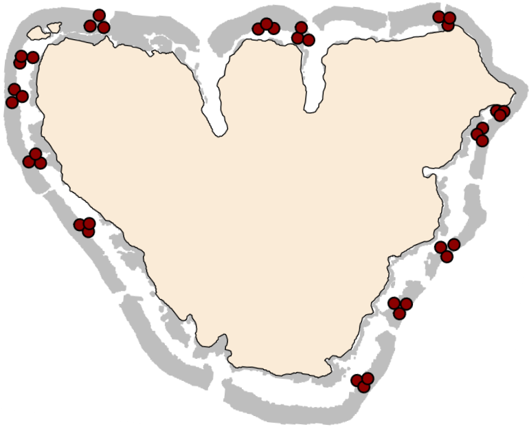
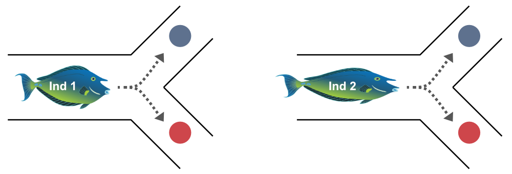
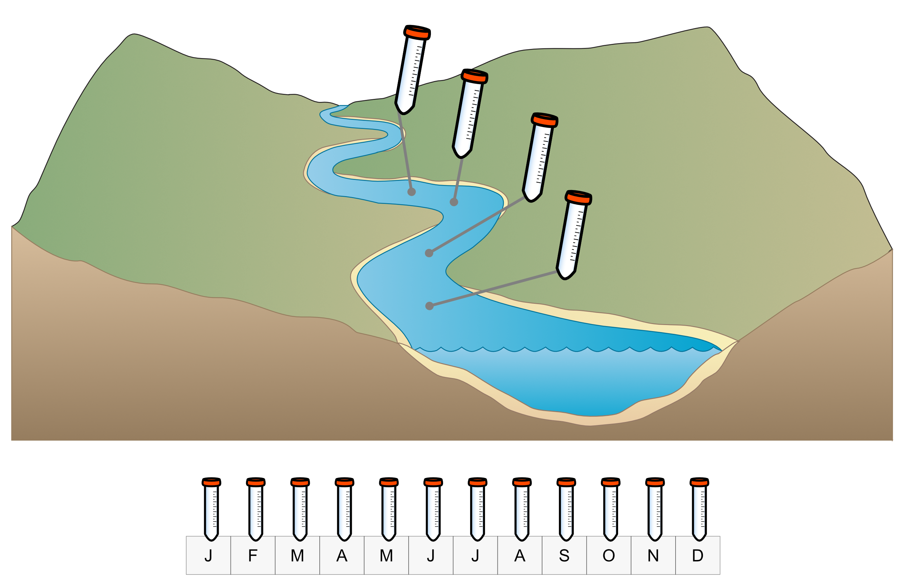

```{r}
#| echo: false

library(palmerpenguins)
library(tidyverse)
library(emmeans)
library(performance)
library(ggthemes)
library(modelbased)
library(patchwork)

penguins <- penguins %>%
  na.omit()
```


## Les trois hypothèses clés {.smaller}

::: med-space
:::


::: {.columns}
::: {.column width="33%"}
#### 1. Indépendance

Les observations sont indépendantes les unes des autres
:::
::: {.column width="33%"}
#### 2. Homoscédasticité

La variance des résidus est constante


:::
::: {.column width="33%"}
#### 3. Normalité

Les résidus suivent une distribution normale
:::
:::

::: {.columns}
::: {.column width="33%"}

{height="260"}

:::
::: {.column width="33%"}

```{r}
#| fig-height: 9

set.seed(123)
n <- 200
x <- runif(n, 0, 10)
y <- 2 + 3 * x + rnorm(n, 0, 0.5 * (2 + 3 * x))

df_hetero <- tibble(x = x, y = y)

ggplot(df_hetero, aes(x = x, y = y)) +
  geom_smooth(method = "lm", se = FALSE, color = "darkred") +
  geom_point(alpha = 0.6) +
  labs(
    x = "x",
    y = "y"
  ) +
  theme_classic(base_size = 26)
```

:::
::: {.column width="33%"}

```{r}
#| fig-height: 9

set.seed(456)
n <- 200
x2 <- runif(n, 0, 10)
y2 <- 5 + 2 * x2 + rexp(n, rate = 0.5)

df_skew <- tibble(x = x2, y = y2)
m_skew <- lm(y ~ x, data = df_skew)

resid_df <- tibble(resid = residuals(m_skew))

ggplot(resid_df, aes(x = resid)) +
  geom_histogram(
    aes(y = after_stat(density)),
    bins = 30,
    fill = "lightblue",
    color = "black"
  ) +
  stat_function(
    fun = dnorm,
    args = list(mean = mean(resid_df$resid), sd = sd(resid_df$resid)),
    color = "red",
    linewidth = 1
  ) +
  labs(
    x = "Residuals",
    y = "Density"
  ) +
  theme_classic(base_size = 26)

```

:::
:::

## Hypothèse 1 : Indépendance {.smaller}

::: med-space
:::

::: {.columns}
::: {.column}


#### Les observations sont indépendantes

*Violation = une observation influence une autre*

-   Mesures répétées des mêmes individus
-   Impact spatial
-   Pseudo-réplication
-   Structure hiérarchique (sites, populations)

:::
::: {.column}
::: fragment
#### Conséquences

-   Sous-estimation de l'erreur-type
-   Intervalles de confiance trop étroits
-   Valeurs p trop petites

::: question
Ce sont des conséquences graves !
:::
:::
:::
:::

## Hypothèse 1 : Indépendance {.smaller}

::: med-space
:::

#### Structure hiérarchique

{fig-align="center"}

## Hypothèse 1 : Indépendance {.smaller}

::: med-space
:::
#### Mesures répétées

{fig-align="center"}

## Hypothèse 1 : Indépendance {.smaller}

::: med-space
:::

#### Corrélation spatiale/temporelle

{fig-align="center"}


## Hypothèse 2 : Homoscédasticité {.smaller}

::: med-space
:::

::::: columns
::: column
```{r}
#| fig-height: 7

set.seed(123)
x <- runif(100, 0, 10)
y_homo <- 2 + 3 * x + rnorm(100, 0, 2)

data.frame(x = x, y = y_homo) %>%
  ggplot(aes(x = x, y = y)) +
  geom_point(alpha = 0.6) +
  geom_smooth(method = "lm", color = "darkred", se = F) +
  labs(
    title = "Homoscedasticity",
    x = "Predictor",
    y = "Response"
  ) +
  theme_classic(base_size = 26)
```

<div style="text-align: center;">
**Variance constante**
</div>

:::
::: column
```{r}
#| fig-height: 7

y_hetero <- 2 + 3 * x + rnorm(100, 0, 0.5 * (2 + 3 * x))

data.frame(x = x, y = y_hetero) %>%
  ggplot(aes(x = x, y = y)) +
  geom_point(alpha = 0.6) +
  geom_smooth(method = "lm", color = "darkred", se = F) +
  labs(
    title = "Heteroscedasticity",
    x = "Predictor",
    y = "Response"
  ) +
  theme_classic(base_size = 26)
```

<div style="text-align: center;">
**La variance augmente**
</div>

:::
:::::

$$
\begin{align}
y_i &\sim \mathrm{Normal}(\mu_i,~{\color{#D81B60}{\sigma}}) \\
\mu_i &= a + b x_i
\end{align}
$$


## Hypothèse 2 : Homoscédasticité {.smaller}
::: med-space
:::

::::: columns
::: column
**Exemples**

-   La variance augmente avec la moyenne
-   Données de comptage (abondance)
-   Processus allométriques
-   Taille du corps et métabolisme

:::

::: column
::: fragment
**Conséquences**

-   Erreurs-types biaisées
-   Les IC et tests sont moins fiables
-   Moins grave que la non-indépendance

:::
:::
:::::

## Hypothèse 3 : Normalité des résidus {.smaller}

::: med-space
:::

#### **Les résidus** (pas les données brutes !) suivent une distribution normale

::: {.columns}
::: {.column width="75%"}
```{r}
# Calculate mean for regression line
mean_mass <- mean(penguins$body_mass_g)

# Create plot with residuals
penguins %>%
  filter(species == "Gentoo", ) %>%
  ggplot(aes(x = bill_length_mm, y = body_mass_g)) +
  # Draw residual lines first (so they appear behind points)
  geom_segment(
    aes(xend = bill_length_mm, yend = fitted(lm(body_mass_g ~ bill_length_mm))),
    color = "darkred",
    linewidth = 0.5,
    alpha = 0.6
  ) +
  # Regression line
  geom_smooth(method = "lm", se = FALSE, color = "black", linewidth = 1.5) +
  # Data points
  geom_point(size = 3, color = "steelblue") +
  labs(
    x = "Bill length (mm)",
    y = "Body mass (g)"
  ) +
  theme_classic(base_size = 20)
```


:::
::: {.column width="25%"}

$$
\begin{align}
y_i &\sim \mathrm{\color{#D81B60}{Normal}}(\mu_i,~{\sigma}) \\
\mu_i &= a + b x_i
\end{align}
$$

:::
:::


## Hypothèse 3 : Normalité des résidus {.smaller}

::: med-space
:::

::::: columns
::: column
**Exemples**

-   Données strictement positives (hauteurs, poids)
-   Données en pourcentage (entre 0 et 100%)
-   Données de comptage (abondance)
-   Probabilités (par ex. transects point-intercept)

:::

::: column
::: fragment
**Conséquences**

-   Intervalles de confiance biaisés
-   Les valeurs p sont moins fiables
-   Moins grave que la non-indépendance ou l'hétéroscédasticité grave

:::
:::
:::::


## Évaluation du modèle

::: med-space
:::

::: question
Les hypothèses sont-elles violées ? 

Puis-je me permettre d'utiliser `lm()` ?
:::

::: med-space
:::

Le paquet `performance` aide à décider :

::: med-space
:::

```{r}
#| echo: true
#| output-location: slide

library(performance)

m_spec <- lm(body_mass_g ~ species, data = penguins)

check_model(m_spec)

```

## Évaluation du modèle : Indépendance

::: med-space
:::

-   Aucun graphique ne peut aider pour cela
-   Comprenez vos données. 
   -   Y a-t-il une structure ?
   -   Y a-t-il des groupes corrélés ?
   -   Les individus sont-ils mesurés plusieurs fois ?
   -   Y a-t-il une corrélation spatiale ou temporelle ?

## Évaluation du modèle : Homoscédasticité

::: med-space
:::


```{r}
#| output: false

set.seed(123)
n <- 200


x_good <- runif(n, 5, 30)
y_good <- 0.5 + 0.8 * x_good + rnorm(n, 0, sd = 0.5) # Constant SD, no trend
m_good <- lm(y_good ~ x_good)

x_mild <- runif(n, 5, 30)
y_mild <- 0.5 + 0.8 * x_mild + rnorm(n, 0, sd = 0.2 + 0.2 * x_mild)
m_mild_hetero <- lm(y_mild ~ x_mild)

x_severe <- runif(n, 5, 30)
mean_count <- 1 + 0.6 * x_severe
y_severe <- rpois(n, lambda = pmax(mean_count, 0.1))
m_severe_hetero <- lm(y_severe ~ x_severe)

p_het1 <- plot(check_model(m_good, check = "homogeneity")) +
  theme_light(base_size = 16)
p_het2 <- plot(check_model(m_mild_hetero, check = "homogeneity"))
p_het3 <- plot(check_model(m_severe_hetero, check = "homogeneity"))

```


#### Homoscédastique


```{r}
p_het1
```


## Évaluation du modèle : Homoscédasticité

::: med-space
:::

#### Violation de l'homoscédasticité

```{r}
#| fig-width: 10

(p_het2 | p_het3) +
  plot_layout(ncol = 2)
```


## Évaluation du modèle : Normalité

::: med-space
:::

::::: columns
::: column
```{r}
#| fig-height: 12

# Histogram with normal curve
h_spec <- data.frame(resid = residuals(m_spec)) %>%
  ggplot(aes(x = resid)) +
  geom_histogram(
    aes(y = after_stat(density)),
    bins = 30,
    fill = "lightblue",
    color = "black"
  ) +
  stat_function(
    fun = dnorm,
    args = list(mean = 0, sd = sd(residuals(m_spec))),
    color = "red",
    linewidth = 1
  ) +
  labs(title = "Distribution of residuals", x = "Residuals", y = "Density") +
  theme_light(base_size = 26)

# Q-Q plot
q_spec <- check_normality(m_spec) %>%
  plot() +
  theme_light(base_size = 26)

# Stack histogram on top of Q-Q plot
h_spec / q_spec
```

:::

::: column

::: small

**Graphique Quantile-Quantile (QQ)**

-   Compare les quantiles observés aux quantiles théoriques d'une distribution normale
-   Si les points suivent la ligne : distribution normale
-   Écarts aux extrêmes : queues lourdes/légères
-   Motif en S : asymétrie

:::
:::
:::::

## Évaluation du modèle : Normalité

::: med-space
:::


```{r}
set.seed(123)
n <- 400

# Normal distribution
normal_data <- rnorm(n)
m_normal <- lm(normal_data ~ 1)

# Heavy tails
heavy_tail <- rt(n, df = 1.8)
m_heavy <- lm(heavy_tail ~ 1)

# Skewed data
skewed <- rexp(n, rate = 1)
m_skewed <- lm(skewed ~ 1)

# Histogram + normal curve for normal data
h1 <- data.frame(resid = residuals(m_normal)) %>%
  ggplot(aes(x = resid)) +
  geom_histogram(
    aes(y = after_stat(density)),
    bins = 30,
    fill = "lightblue",
    color = "black"
  ) +
  stat_function(
    fun = dnorm,
    args = list(mean = 0, sd = sd(residuals(m_normal))),
    color = "red",
    linewidth = 1
  ) +
  labs(title = "Normal distribution", x = "Residuals", y = "Density") +
  theme_light(base_size = 12)

# Q-Q plot for normal data
q1 <- check_normality(m_normal) %>%
  plot() +
  ylim(-1, 8) +
  labs(title = NULL) +
  theme_light(base_size = 12)

# Histogram for heavy tails
h2 <- data.frame(resid = residuals(m_heavy)) %>%
  ggplot(aes(x = resid)) +
  geom_histogram(
    aes(y = after_stat(density)),
    bins = 30,
    fill = "lightblue",
    color = "black"
  ) +
  stat_function(
    fun = dnorm,
    args = list(mean = 0, sd = sd(residuals(m_heavy))),
    color = "red",
    linewidth = 1
  ) +
  labs(title = "Heavy tails", x = "Residuals", y = "Density") +
  theme_light(base_size = 12)

# Q-Q plot for heavy tails
q2 <- check_normality(m_heavy) %>%
  plot() +
  ylim(-1, 8) +
  labs(title = NULL) +
  theme_light(base_size = 12)

# Histogram for skewed data
h3 <- data.frame(resid = residuals(m_skewed)) %>%
  ggplot(aes(x = resid)) +
  geom_histogram(
    aes(y = after_stat(density)),
    bins = 30,
    fill = "lightblue",
    color = "black"
  ) +
  stat_function(
    fun = dnorm,
    args = list(mean = 0, sd = sd(residuals(m_skewed))),
    color = "red",
    linewidth = 1
  ) +
  labs(title = "Positive skew", x = "Residuals", y = "Density") +
  theme_light(base_size = 12)

# Q-Q plot for skewed data
q3 <- check_normality(m_skewed) %>%
  plot() +
  ylim(-1, 8) +
  labs(title = NULL) +
  theme_light(base_size = 12)

# Arrange: histograms on top row, Q-Q plots on bottom row
(h1 | h2 | h3) / (q1 | q2 | q3)
```


## Données réelles {.smaller}

::: med-space
:::

-   Les données environnementales réelles violent souvent au moins une de ces hypothèses

-   Au lieu de faire des tests non paramétriques (forçant les données en rangs, par ex. Wilcoxon, Kruskal Wallis, etc.), les modèles linéaires peuvent être étendus


## Données réelles {.smaller}

::: med-space
:::


#### Avantages des modèles linéaires par rapport aux tests non paramétriques

-   Plus faciles à **interpréter** : les coefficients ont une signification biologique réelle

-   Nous modélisons les **données réelles** (grammes, mètres, comptages) au lieu des rangs (1er, 2e, 3e)

-   Les **interactions** (c'est-à-dire que l'effet d'une variable dépend d'une autre) sont possibles

-   Permettent les **prédictions**

-   **Visualisations honnêtes** avec IC et ampleur de l'effet

## Les trois hypothèses clés {.smaller}

::: med-space
:::

::: {.columns}
::: {.column width="33%"}


#### 1. Indépendance

Les observations sont indépendantes les unes des autres

:::
::: {.column width="33%"}
::: {.fragment fragment-index=1}
#### 2. Homoscédasticité

La variance des résidus est constante

:::
:::
::: {.column width="33%"}
::: {.fragment fragment-index=2}
#### 3. Normalité

Les résidus suivent une distribution normale
:::
:::
:::

::: med-space
:::

### En cas de violation


::: {.columns}
::: {.column width="33%"}

Modèles à effets mixtes

(paquet `glmmTMB`)

:::
::: {.column width="33%"}
::: {.fragment fragment-index=1}
Structure de variance 

(paquets `nlme` & `glmmTMB`)

:::
:::
::: {.column width="33%"}

::: {.fragment fragment-index=2}
Modèles linéaires **généralisés** (GLM) 

**=> cours suivant**
:::
:::
:::


## À vous de jouer  {.smaller}

::: med-space
:::

1.  Allez sur le site du cours
2.  Allez au calendrier
3.  Cliquez sur `TP 04`
4.  Connectez-vous à Posit Cloud

::: huge
::: center-align

[andieich.github.io/2026_biostatistiques_2](https://andieich.github.io/2026_biostatistiques_2/)

:::
:::
