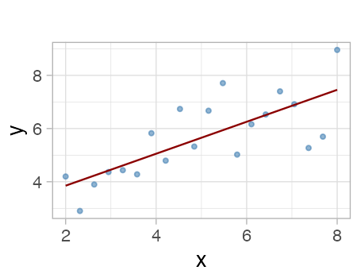
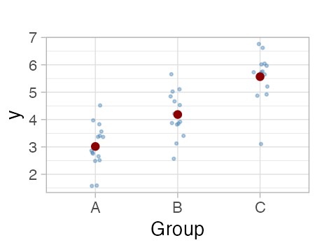
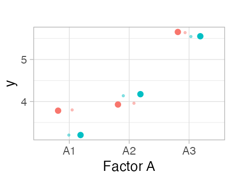
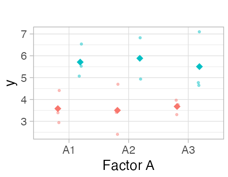
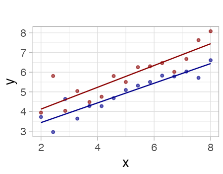
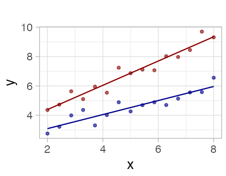

```{r}
#| message: false
#| warning: false
#| echo: false

library(tidyverse)
library(gt)

# Set theme
theme_set(theme_light(base_size = 20))

# Prepare data for examples
set.seed(42)

# Regression example data
reg_data <- tibble(
  x = seq(2, 8, length.out = 20),
  y = 1.5 + 0.8 * x + rnorm(20, 0, 0.8)
)

# ANOVA example data (3 groups)
anova_data <- tibble(
  group = rep(c("A", "B", "C"), each = 15),
  y = c(
    rnorm(15, mean = 3, sd = 0.8),
    rnorm(15, mean = 4.5, sd = 0.8),
    rnorm(15, mean = 5.5, sd = 0.8)
  )
)

# ANOVA additive (2 factors)
anova_add_data <- expand_grid(
  factor_a = c("A1", "A2", "A3"),
  factor_b = c("B1", "B2")
) %>%
  mutate(
    y = case_when(
      factor_a == "A1" ~ rnorm(6, mean = 3, sd = 0.6),
      factor_a == "A2" ~ rnorm(6, mean = 4.5, sd = 0.6),
      factor_a == "A3" ~ rnorm(6, mean = 5.5, sd = 0.6),
      TRUE ~ NA_real_
    )
  )

# ANOVA interactive (2 factors with interaction)
anova_int_data <- tibble(
  factor_a = rep(c("A1", "A2", "A3"), times = 6),
  factor_b = rep(c("B1", "B2"), each = 9),
  y = c(
    rnorm(3, mean = 3, sd = 0.5), # A1, B1
    rnorm(3, mean = 3.5, sd = 0.5), # A2, B1
    rnorm(3, mean = 4, sd = 0.5), # A3, B1
    rnorm(3, mean = 5.2, sd = 0.5), # A1, B2
    rnorm(3, mean = 5.5, sd = 0.5), # A2, B2
    rnorm(3, mean = 6.5, sd = 0.5) # A3, B2
  )
)

# ANCOVA additive data
ancova_add_data <- tibble(
  x = c(seq(2, 8, length.out = 15), seq(2, 8, length.out = 15)),
  group = rep(c("Group1", "Group2"), each = 15),
  y = c(
    2 + 0.6 * seq(2, 8, length.out = 15) + rnorm(15, 0, 0.5),
    3 + 0.6 * seq(2, 8, length.out = 15) + rnorm(15, 0, 0.5)
  )
)

# ANCOVA interactive data
ancova_int_data <- tibble(
  x = c(seq(2, 8, length.out = 15), seq(2, 8, length.out = 15)),
  group = rep(c("Group1", "Group2"), each = 15),
  y = c(
    2 + 0.5 * seq(2, 8, length.out = 15) + rnorm(15, 0, 0.5),
    3 + 0.8 * seq(2, 8, length.out = 15) + rnorm(15, 0, 0.5)
  )
)

# Define plot functions
plot_regression <- function() {
  ggplot(reg_data, aes(x = x, y = y)) +
    geom_point(color = "steelblue", size = 1.5, alpha = 0.6) +
    geom_smooth(method = "lm", se = FALSE, color = "darkred", linewidth = 0.8) +
    labs(x = "x", y = "y", title = "") +
    theme(plot.margin = margin(2, 2, 2, 2, "mm"))
}

plot_anova <- function() {
  anova_stats <- anova_data %>%
    group_by(group) %>%
    summarise(mean = mean(y), .groups = "drop")

  ggplot() +
    geom_jitter(
      data = anova_data,
      aes(x = group, y = y),
      width = 0.1,
      alpha = 0.4,
      size = 1,
      color = "steelblue"
    ) +
    geom_point(
      data = anova_stats,
      aes(x = group, y = mean),
      size = 3,
      color = "darkred"
    ) +
    labs(x = "Group", y = "y", title = "") +
    theme(plot.margin = margin(2, 2, 2, 2, "mm"))
}

plot_anova_add <- function() {
  anova_add_stats <- anova_add_data %>%
    group_by(factor_a, factor_b) %>%
    summarise(mean = mean(y), .groups = "drop")

  ggplot() +
    geom_jitter(
      data = anova_add_data,
      aes(x = factor_a, y = y, color = factor_b),
      width = 0.1,
      alpha = 0.4,
      size = 1,
      show.legend = FALSE
    ) +
    geom_point(
      data = anova_add_stats,
      aes(x = factor_a, y = mean, color = factor_b),
      position = position_dodge(width = 0.75),
      size = 3,
      show.legend = FALSE
    ) +
    labs(x = "Factor A", y = "y", title = "") +
    theme(plot.margin = margin(2, 2, 2, 2, "mm"))
}

plot_anova_int <- function() {
  anova_int_stats <- anova_int_data %>%
    group_by(factor_a, factor_b) %>%
    summarise(
      mean = mean(y),
      .groups = "drop"
    )

  ggplot() +
    geom_point(
      data = anova_int_data,
      aes(x = factor_a, y = y, color = factor_b),
      position = position_jitterdodge(jitter.width = 0.1, dodge.width = 0.75),
      alpha = 0.4,
      size = 1,
      show.legend = FALSE
    ) +
    geom_point(
      data = anova_int_stats,
      aes(x = factor_a, y = mean, color = factor_b),
      position = position_dodge(width = 0.75),
      size = 4,
      shape = 18,
      show.legend = FALSE
    ) +
    labs(x = "Factor A", y = "y", title = "") +
    theme(legend.position = "none", plot.margin = margin(2, 2, 2, 2, "mm"))
}

plot_ancova_add <- function() {
  ggplot(ancova_add_data, aes(x = x, y = y, color = group)) +
    geom_point(alpha = 0.6, size = 1.5, show.legend = FALSE) +
    geom_smooth(
      method = "lm",
      se = FALSE,
      linewidth = 0.8,
      show.legend = FALSE
    ) +
    labs(x = "x", y = "y", title = "") +
    scale_color_manual(
      values = c("Group1" = "darkblue", "Group2" = "darkred")
    ) +
    theme(plot.margin = margin(2, 2, 2, 2, "mm"))
}

plot_ancova_int <- function() {
  ggplot(ancova_int_data, aes(x = x, y = y, color = group)) +
    geom_point(alpha = 0.6, size = 1.5, show.legend = FALSE) +
    geom_smooth(
      method = "lm",
      se = FALSE,
      linewidth = 0.8,
      show.legend = FALSE
    ) +
    labs(x = "x", y = "y", title = "") +
    scale_color_manual(
      values = c("Group1" = "darkblue", "Group2" = "darkred")
    ) +
    theme(plot.margin = margin(2, 2, 2, 2, "mm"))
}
```

```{r}
#| message: false
#| warning: false
#| echo: false
#| include: false

# Generate and save plots
p1 <- plot_regression()
p2 <- plot_anova()
p3 <- plot_anova_add()
p4 <- plot_anova_int()
p5 <- plot_ancova_add()
p6 <- plot_ancova_int()

# Create output directory if it doesn't exist
dir.create("output/04", showWarnings = FALSE, recursive = TRUE)

# Save plots in working directory
ggsave("plot_1.png", p1, width = 4.5, height = 3.5, dpi = 100)
ggsave("plot_2.png", p2, width = 4.5, height = 3.5, dpi = 100)
ggsave("plot_3.png", p3, width = 4.5, height = 3.5, dpi = 100)
ggsave("plot_4.png", p4, width = 4.5, height = 3.5, dpi = 100)
ggsave("plot_5.png", p5, width = 4.5, height = 3.5, dpi = 100)
ggsave("plot_6.png", p6, width = 4.5, height = 3.5, dpi = 100)

# Also save to output directory for reference
ggsave("output/04/plot_1.png", p1, width = 4.5, height = 3.5, dpi = 100)
ggsave("output/04/plot_2.png", p2, width = 4.5, height = 3.5, dpi = 100)
ggsave("output/04/plot_3.png", p3, width = 4.5, height = 3.5, dpi = 100)
ggsave("output/04/plot_4.png", p4, width = 4.5, height = 3.5, dpi = 100)
ggsave("output/04/plot_5.png", p5, width = 4.5, height = 3.5, dpi = 100)
ggsave("output/04/plot_6.png", p6, width = 4.5, height = 3.5, dpi = 100)

invisible(NULL)
```

## Linear Models Summary

```{r}
#| echo: false
#| message: false

models_data <- tibble(
  Name = c(
    "**Regression**",
    "**ANOVA**",
    "**ANOVA (Additive)**",
    "**ANOVA (Interaction)**",
    "**ANCOVA (Additive)**",
    "**ANCOVA (Interactive)**"
  ),
  Formula = c(
    "`lm(y ~ x)`",
    "`lm(y ~ A)`",
    "`lm(y ~ A + B)`",
    "`lm(y ~ A * B)`",
    "`lm(y ~ x + A)`",
    "`lm(y ~ x * A)`"
  ),
  Variables = c(
    "1 numeric (`x`)",
    "1 categorical (`A`)",
    "2 categorical (`A`, `B`)",
    "2 categorical (`A`, `B`)",
    "1 numeric (`x`)<br>1 categorical (`A`)",
    "1 numeric (`x`)<br>1 categorical (`A`)"
  ),
  Description = c(
    "Estimate linear relationship between continuous variables",
    "Compare means across groups; test if groups differ",
    "Assess impact of 2 factors separately; assumes additive effects",
    "Assess impact of 2 factors; effect of A depends on B",
    "Compare group intercepts on same regression line (parallel lines)",
    "Compare different regression slopes across groups"
  ),
  `Penguin Example` = c(
    "How does bill length affect body mass?",
    "Does body mass differ between species?",
    "How do species and sex affect body mass separately?",
    "Do species and sex interact to affect body mass?",
    "How does bill length affect body mass, accounting for species differences?",
    "Does the relationship between bill length and body mass differ by species?"
  ),
  `Generic Example` = c(
    "How does temperature affect growth rate?",
    "Does survival differ between treatments?",
    "How do fertilizer and water affect yield separately?",
    "Do fertilizer and water interact to affect yield?",
    "How does temperature affect growth, accounting for genotype differences?",
    "Does the relationship between temperature and growth differ by genotype?"
  ),
  Plot = c(
    "{width=250px height=200px}",
    "{width=250px height=200px}",
    "{width=250px height=200px}",
    "{width=250px height=200px}",
    "{width=250px height=200px}",
    "{width=250px height=200px}"
  )
)

# Create the gt table
gt_table <- gt(models_data) %>%
  cols_width(
    Name ~ pct(8),
    Formula ~ pct(8),
    Variables ~ pct(10),
    Description ~ pct(15),
    `Penguin Example` ~ pct(12),
    `Generic Example` ~ pct(12),
    Plot ~ pct(35)
  ) %>%
  tab_header(
    title = "Common statistical models for comparing groups and estimating relationships"
  ) %>%
  tab_options(
    table.width = pct(100),
    heading.background.color = "#e8e8e8",
    column_labels.background.color = "#f5f5f5",
    table.border.top.style = "solid",
    table.border.bottom.style = "solid",
    table.border.top.color = "#999",
    table.border.bottom.color = "#999"
  ) %>%
  fmt_markdown(columns = everything())

gt_table
```

