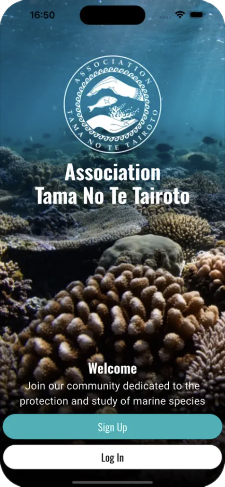
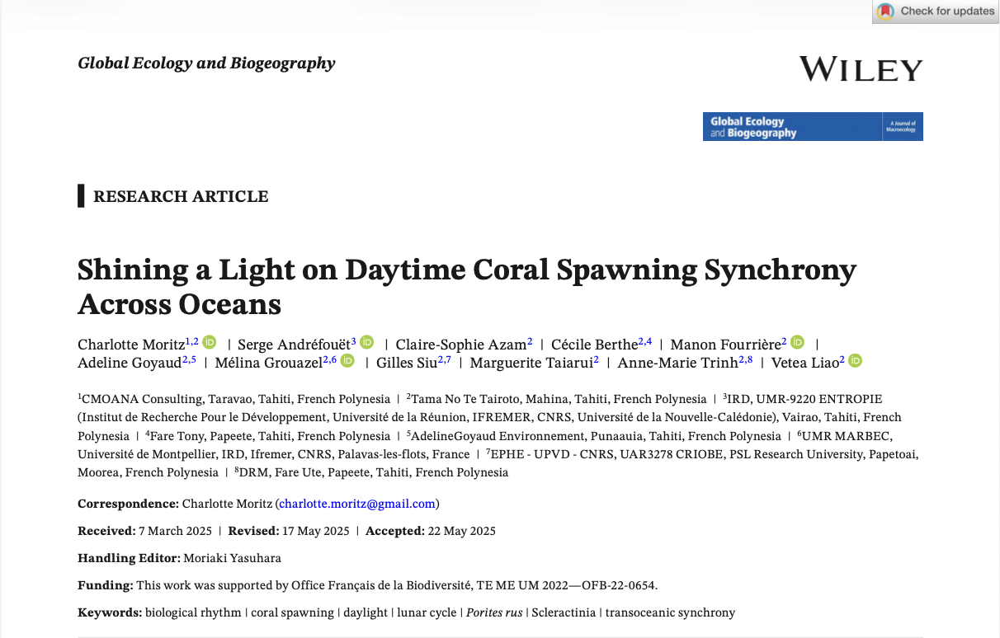



## Jeu de données {.smaller}

::::: columns
::: {.column width="30%"}
{height="450"}
:::

::: {.column width="70%"}
- 426 observations
- 134 sites
- 18 îles
- \> 500 participants
:::
:::::

<!-- end columns -->

## Analyse {.smaller}

::::: columns
::: {.column width="35%"}

:::

::: {.column width="65%"}
- Utiliser des modèles `(g)lm` pour identifier des motifs temporels globaux
- Analyse approfondie de l'impact du lever du soleil, de la température de l'eau, du sexe et de l'habitat
- Données et analyses disponibles en ligne
:::
:::::

<!-- end columns -->

## Remerciements {.smaller}

Merci à Vetea Liao et à Charlotte Moritz de m'avoir permis d'utiliser son analyse

{fig-align="center" height="350"}
