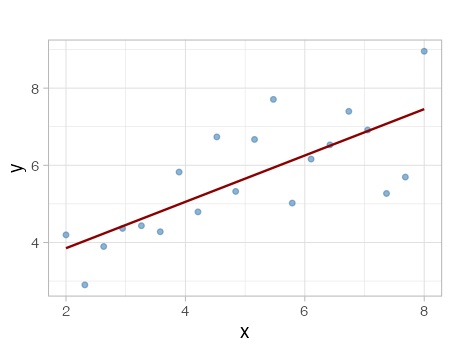
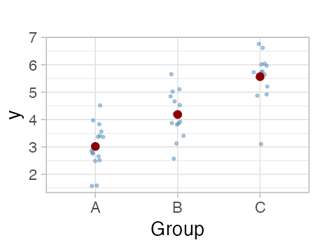
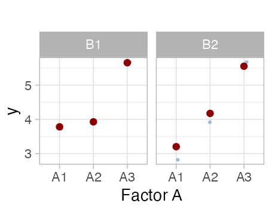
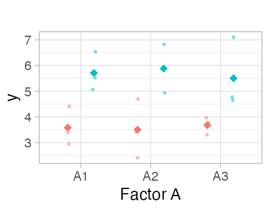
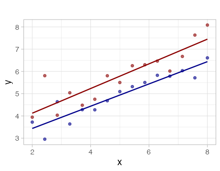
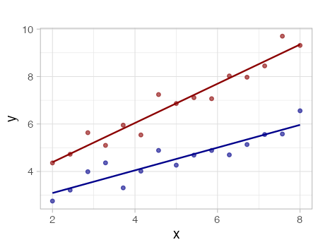

```{r}
#| message: false
#| warning: false
#| echo: false

library(tidyverse)
library(gt)

# Set theme
theme_set(theme_light(base_size = 20))

# Prepare data for examples
set.seed(42)

# Regression example data
reg_data <- tibble(
  x = seq(2, 8, length.out = 20),
  y = 1.5 + 0.8 * x + rnorm(20, 0, 0.8)
)

# ANOVA example data (3 groups)
anova_data <- tibble(
  group = rep(c("A", "B", "C"), each = 15),
  y = c(
    rnorm(15, mean = 3, sd = 0.8),
    rnorm(15, mean = 4.5, sd = 0.8),
    rnorm(15, mean = 5.5, sd = 0.8)
  )
)

# ANOVA additive (2 factors)
anova_add_data <- expand_grid(
  factor_a = c("A1", "A2", "A3"),
  factor_b = c("B1", "B2")
) %>%
  mutate(
    y = case_when(
      factor_a == "A1" ~ rnorm(6, mean = 3, sd = 0.6),
      factor_a == "A2" ~ rnorm(6, mean = 4.5, sd = 0.6),
      factor_a == "A3" ~ rnorm(6, mean = 5.5, sd = 0.6),
      TRUE ~ NA_real_
    )
  )

# ANOVA interactive (2 factors with interaction)
anova_int_data <- tibble(
  factor_a = rep(c("A1", "A2", "A3"), times = 6),
  factor_b = rep(c("B1", "B2"), each = 9),
  y = c(
    rnorm(3, mean = 3, sd = 0.5), # A1, B1
    rnorm(3, mean = 3.5, sd = 0.5), # A2, B1
    rnorm(3, mean = 4, sd = 0.5), # A3, B1
    rnorm(3, mean = 5.2, sd = 0.5), # A1, B2
    rnorm(3, mean = 5.5, sd = 0.5), # A2, B2
    rnorm(3, mean = 6.5, sd = 0.5) # A3, B2
  )
)

# ANCOVA additive data
ancova_add_data <- tibble(
  x = c(seq(2, 8, length.out = 15), seq(2, 8, length.out = 15)),
  group = rep(c("Group1", "Group2"), each = 15),
  y = c(
    2 + 0.6 * seq(2, 8, length.out = 15) + rnorm(15, 0, 0.5),
    3 + 0.6 * seq(2, 8, length.out = 15) + rnorm(15, 0, 0.5)
  )
)

# ANCOVA interactive data
ancova_int_data <- tibble(
  x = c(seq(2, 8, length.out = 15), seq(2, 8, length.out = 15)),
  group = rep(c("Group1", "Group2"), each = 15),
  y = c(
    2 + 0.5 * seq(2, 8, length.out = 15) + rnorm(15, 0, 0.5),
    3 + 0.8 * seq(2, 8, length.out = 15) + rnorm(15, 0, 0.5)
  )
)

# Define plot functions
plot_regression <- function() {
  ggplot(reg_data, aes(x = x, y = y)) +
    geom_point(color = "steelblue", size = 1.5, alpha = 0.6) +
    geom_smooth(method = "lm", se = FALSE, color = "darkred", linewidth = 0.8) +
    labs(x = "x", y = "y", title = "") +
    theme(
      plot.margin = margin(2, 2, 2, 2, "mm"),
      panel.background = element_rect(fill = "transparent", color = NA),
      plot.background = element_rect(fill = "transparent", color = NA)
    )
}

plot_anova <- function() {
  anova_stats <- anova_data %>%
    group_by(group) %>%
    summarise(mean = mean(y), .groups = "drop")

  ggplot() +
    geom_jitter(
      data = anova_data,
      aes(x = group, y = y),
      width = 0.1,
      alpha = 0.4,
      size = 1,
      color = "steelblue"
    ) +
    geom_point(
      data = anova_stats,
      aes(x = group, y = mean),
      size = 3,
      color = "darkred"
    ) +
    labs(x = "Group", y = "y", title = "") +
    theme(
      plot.margin = margin(2, 2, 2, 2, "mm"),
      panel.background = element_rect(fill = "transparent", color = NA),
      plot.background = element_rect(fill = "transparent", color = NA)
    )
}

plot_anova_add <- function() {
  anova_add_stats <- anova_add_data %>%
    group_by(factor_a, factor_b) %>%
    summarise(mean = mean(y), .groups = "drop")

  ggplot() +
    geom_jitter(
      data = anova_add_data,
      aes(x = factor_a, y = y),
      width = 0.1,
      alpha = 0.4,
      size = 1,
      color = "steelblue"
    ) +
    geom_point(
      data = anova_add_stats,
      aes(x = factor_a, y = mean),
      size = 3,
      color = "darkred"
    ) +
    facet_wrap(~factor_b) +
    labs(x = "Factor A", y = "y", title = "") +
    theme(
      plot.margin = margin(2, 2, 2, 2, "mm"),
      panel.background = element_rect(fill = "transparent", color = NA),
      plot.background = element_rect(fill = "transparent", color = NA)
    )
}

plot_anova_int <- function() {
  anova_int_stats <- anova_int_data %>%
    group_by(factor_a, factor_b) %>%
    summarise(
      mean = mean(y),
      .groups = "drop"
    )

  ggplot() +
    geom_point(
      data = anova_int_data,
      aes(x = factor_a, y = y, color = factor_b),
      position = position_jitterdodge(jitter.width = 0.1, dodge.width = 0.75),
      alpha = 0.4,
      size = 1,
      show.legend = FALSE
    ) +
    geom_point(
      data = anova_int_stats,
      aes(x = factor_a, y = mean, color = factor_b),
      position = position_dodge(width = 0.75),
      size = 4,
      shape = 18,
      show.legend = FALSE
    ) +
    labs(x = "Factor A", y = "y", title = "") +
    theme(
      legend.position = "none",
      plot.margin = margin(2, 2, 2, 2, "mm"),
      panel.background = element_rect(fill = "transparent", color = NA),
      plot.background = element_rect(fill = "transparent", color = NA)
    )
}

plot_ancova_add <- function() {
  ggplot(ancova_add_data, aes(x = x, y = y, color = group)) +
    geom_point(alpha = 0.6, size = 1.5, show.legend = FALSE) +
    geom_smooth(
      method = "lm",
      se = FALSE,
      linewidth = 0.8,
      show.legend = FALSE
    ) +
    labs(x = "x", y = "y", title = "") +
    scale_color_manual(
      values = c("Group1" = "darkblue", "Group2" = "darkred")
    ) +
    theme(
      plot.margin = margin(2, 2, 2, 2, "mm"),
      panel.background = element_rect(fill = "transparent", color = NA),
      plot.background = element_rect(fill = "transparent", color = NA)
    )
}

plot_ancova_int <- function() {
  ggplot(ancova_int_data, aes(x = x, y = y, color = group)) +
    geom_point(alpha = 0.6, size = 1.5, show.legend = FALSE) +
    geom_smooth(
      method = "lm",
      se = FALSE,
      linewidth = 0.8,
      show.legend = FALSE
    ) +
    labs(x = "x", y = "y", title = "") +
    scale_color_manual(
      values = c("Group1" = "darkblue", "Group2" = "darkred")
    ) +
    theme(
      plot.margin = margin(2, 2, 2, 2, "mm"),
      panel.background = element_rect(fill = "transparent", color = NA),
      plot.background = element_rect(fill = "transparent", color = NA)
    )
}
```

```{r}
#| message: false
#| warning: false
#| echo: false
#| include: false

# Generate and save plots
p1 <- plot_regression()
p2 <- plot_anova()
p3 <- plot_anova_add()
p4 <- plot_anova_int()
p5 <- plot_ancova_add()
p6 <- plot_ancova_int()

# Create output directory if it doesn't exist
dir.create("images_summary", showWarnings = FALSE, recursive = TRUE)


# Save to output directory for reference
ggsave("images_summary/plot_1.png", p1, width = 4.5, height = 3.5, dpi = 100)
ggsave("images_summary/plot_2.png", p2, width = 4.5, height = 3.5, dpi = 100)
ggsave("images_summary/plot_3.png", p3, width = 4.5, height = 3.5, dpi = 100)
ggsave("images_summary/plot_4.png", p4, width = 4.5, height = 3.5, dpi = 100)
ggsave("images_summary/plot_5.png", p5, width = 4.5, height = 3.5, dpi = 100)
ggsave("images_summary/plot_6.png", p6, width = 4.5, height = 3.5, dpi = 100)

invisible(NULL)
```

## Résumé des modèles linéaires

```{r}
#| echo: false
#| message: false

models_data <- tibble(
  Name = c(
    "**Regression**",
    "**ANOVA**",
    "**ANOVA (Additive)**",
    "**ANOVA (Interactive)**",
    "**ANCOVA (Additive)**",
    "**ANCOVA (Interactive)**"
  ),
  Formula = c(
    "`lm(y ~ x)`",
    "`lm(y ~ A)`",
    "`lm(y ~ A + B)`",
    "`lm(y ~ A * B)`",
    "`lm(y ~ x + A)`",
    "`lm(y ~ x * A)`"
  ),
  Variables = c(
    "• 1 numérique (x)",
    "• 1 catégorique (A)",
    "• 2 catégoriques (A, B)",
    "• 2 catégoriques (A, B)",
    "• 1 numérique (x)<br>• 1 catégorique (A)",
    "• 1 numérique (x)<br>• 1 catégorique (A)"
  ),
  Description = c(
    "Estimer la relation linéaire entre variables continues",
    "Comparer les moyennes entre groupes ; tester si les groupes diffèrent",
    "Évaluer l'impact de 2 facteurs séparément ; assume des effets additifs",
    "Évaluer l'impact de 2 facteurs ; l'effet de A dépend de B",
    "Comparer les ordonnées à l'origine entre groupes sur la même droite de régression (droites parallèles)",
    "Comparer les pentes de régression différentes selon les groupes"
  ),
  `Exemple Manchot` = c(
    "Comment la longueur du bec affecte-t-elle la masse corporelle ?",
    "La masse corporelle diffère-t-elle selon l'espèce ?",
    "Comment l'espèce et le sexe affectent-ils la masse corporelle séparément ?",
    "L'espèce et le sexe interagissent-ils pour affecter la masse corporelle ?",
    "Comment la longueur du bec affecte-t-elle la masse corporelle, en tenant compte des différences d'espèce ?",
    "La relation entre la longueur du bec et la masse corporelle diffère-t-elle selon l'espèce ?"
  ),
  `Exemple générique` = c(
    "Comment la température affecte-t-elle le taux de croissance ?",
    "La survie diffère-t-elle selon les traitements ?",
    "Comment l'engrais et l'eau affectent-ils le rendement séparément ?",
    "L'engrais et l'eau interagissent-ils pour affecter le rendement ?",
    "Comment la température affecte-t-elle la croissance, en tenant compte des différences de génotype ?",
    "La relation entre la température et la croissance diffère-t-elle selon le génotype ?"
  ),
  Plot = c(
    "{width=250px height=200px}",
    "{width=250px height=200px}",
    "{width=250px height=200px}",
    "{width=250px height=200px}",
    "{width=250px height=200px}",
    "{width=250px height=200px}"
  )
)

# Create the gt table
gt_table <- gt(models_data) %>%
  cols_width(
    Name ~ pct(7),
    Formula ~ pct(11),
    Variables ~ pct(16),
    Description ~ pct(15),
    `Exemple Manchot` ~ pct(12),
    `Exemple générique` ~ pct(12),
    Plot ~ pct(30)
  ) %>%
  tab_options(
    table.width = pct(100),
    heading.background.color = "#e8e8e8",
    column_labels.background.color = "#f5f5f5",
    table.border.top.style = "solid",
    table.border.bottom.style = "solid",
    table.border.top.color = "#999",
    table.border.bottom.color = "#999",
    table.font.size = "12px"
  ) %>%
  tab_style(
    style = cell_text(align = "left", v_align = "top", size = "12px"),
    locations = cells_body()
  ) %>%
  tab_style(
    style = cell_text(weight = "bold", size = "12px"),
    locations = cells_column_labels()
  ) %>%
  fmt_markdown(columns = everything())

gt_table
```
